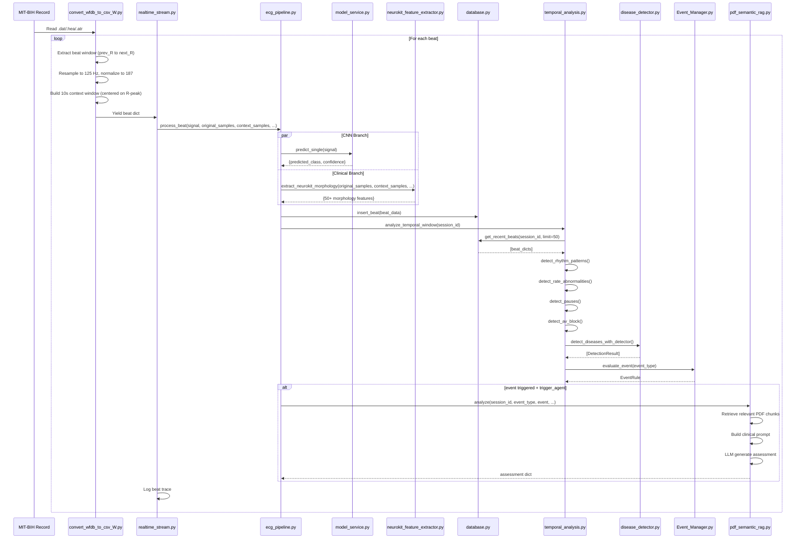
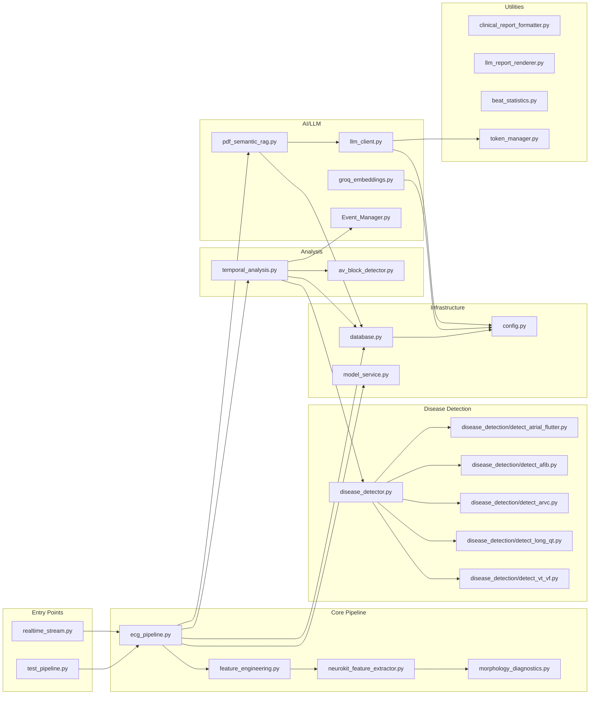

# ECG Clinical Intelligence Pipeline — Complete Architecture Documentation

> **Version:** 2.0  
> **Last Updated:** 2026-07-26  
> **Purpose:** Single source of truth for the entire codebase. A new AI or engineer should be able to understand the project from this document alone.

---

## Table of Contents

1. [Project Overview](#1-project-overview)
2. [Directory Structure](#2-directory-structure)
3. [File Documentation](#3-file-documentation)
4. [Function Documentation](#4-function-documentation)
5. [Class Documentation](#5-class-documentation)
6. [Execution Flow](#6-execution-flow)
7. [Architecture Diagrams](#7-architecture-diagrams)
8. [Module Dependency Graph](#8-module-dependency-graph)
9. [ECG Pipeline](#9-ecg-pipeline)
10. [Disease Detection Architecture](#10-disease-detection-architecture)
11. [Feature Extraction](#11-feature-extraction)
12. [Machine Learning](#12-machine-learning)
13. [Database](#13-database)
14. [Agent Architecture](#14-agent-architecture)
15. [Configuration](#15-configuration)
16. [Public APIs](#16-public-apis)
17. [Utilities](#17-utilities)
18. [Current Limitations](#18-current-limitations)
19. [Extension Guide](#19-extension-guide)
20. [Reading Guide](#20-reading-guide)
21. [AI Knowledge Base](#21-ai-knowledge-base)
22. [Searchable Index](#22-searchable-index)

---

## 1. Project Overview

### What the Project Does

This is a **dual-branch ECG clinical intelligence pipeline** that processes raw ECG signals (MIT-BIH format) through:

1. **CNN Branch** — A trained convolutional neural network classifies each beat into 5 AAMI classes (N, S, V, F, Q)
2. **Clinical Branch** — NeuroKit2-based morphology extraction computes clinical intervals, amplitudes, and features
3. **Temporal Analysis** — Sliding-window rhythm analysis detects patterns (bigeminy, trigeminy, couplets, pauses, AV block)
4. **Disease Detection** — Rule-based clinical detectors identify 15+ cardiac conditions using AHA/ESC guidelines
5. **RAG Agent** — When critical events fire, a Retrieval-Augmented Generation system queries a clinical PDF knowledge base and produces LLM-powered assessments

### Main Purpose

Real-time or offline ECG monitoring and diagnosis system that combines:

- Beat-level classification (CNN)
- Clinical morphology measurements (NeuroKit2)
- Rhythm-level pattern detection
- Evidence-based disease detection with published clinical thresholds
- AI-powered clinical report generation via RAG

### High-Level Workflow

```
Raw MIT-BIH Record (360 Hz)
    │
    ▼
iter_record_beats() — beat-by-beat extraction with 10s context window
    │
    ▼
ECGPipeline.process_beat()
    ├──► CNN Branch: 187-sample → CNN → label (N/S/V/F/Q)
    └──► Clinical Branch: 360 Hz → NK2 morphology → features
              │
              ▼
    db.insert_beat() — store features
              │
              ▼
    analyze_temporal_window() — sliding window analysis
        ├── detect_rhythm_patterns() — bigeminy, trigeminy, couplets
        ├── detect_rate_abnormalities() — tachycardia, bradycardia
        ├── detect_pauses() — pause detection
        ├── detect_av_block() — AV block classification
        └── detect_diseases_with_detector() — 15+ disease detectors
              │
              ▼
    Event_Manager — evaluate_event() → known_event + trigger_agent
              │
              ▼
    PDFSemanticECGAgent — RAG over clinical PDF → LLM → report
              │
              ▼
    Database — store events, agent interactions
```

### Main Technologies

| Technology | Purpose |
|-----------|---------|
| Python 3.13 | Runtime |
| TensorFlow/Keras | CNN model inference |
| NeuroKit2 | ECG morphology extraction (DWT delineation) |
| WFDB | MIT-BIH record reading |
| PostgreSQL + pgvector | Data persistence + vector search |
| sentence-transformers | PDF embedding (all-MiniLM-L6-v2) |
| Groq API | LLM inference (or HuggingFace/local fallback) |
| NumPy/SciPy | Signal processing, FFT |
| psycopg2 | PostgreSQL adapter |

### Core Components

| Component | File | Responsibility |
|-----------|------|---------------|
| Data Source | `convert_wfdb_to_csv_W.py` | MIT-BIH beat extraction, CNN resampling, context window |
| Pipeline Orchestrator | `ecg_pipeline.py` | Dual-branch processing, event loop |
| CNN Model | `model_service.py` | Beat classification (5-class) |
| Morphology | `neurokit_feature_extractor.py` | NK2-based P/QRS/T delineation |
| Feature Packaging | `feature_engineering.py` | Maps NK2 output to DB schema |
| Temporal Analysis | `temporal_analysis.py` | Sliding window rhythm analysis |
| Disease Detector | `disease_detector.py` | 15+ rule-based detectors |
| Disease Detectors | `disease_detection/` | Specialized window-level detectors |
| AV Block | `av_block_detector.py` | P-wave/QRS ratio analysis |
| Event Manager | `Event_Manager.py` | Event routing, agent triggers |
| Database | `database.py` | PostgreSQL persistence |
| RAG Agent | `pdf_semantic_rag.py` | PDF knowledge retrieval + LLM |
| LLM Client | `llm_client.py` | Multi-backend LLM abstraction |
| CLI | `realtime_stream.py` | Real-time simulation CLI |
| Episode Manager | `episode_manager.py` | Clinical episode tracking (RECURRENCE/STATE/CLUSTER) |
| Episode Shim | `episode_integration_shim.py` | Maps episode actions to storage_status |
| Episode Integration | `temporal_analysis_episode_integration.py` | Reference code for episode-based cooldown |
| Kafka Raw Consumer | `kafka_raw_consumer.py` | RawECGStreamProcessor — buffers signal, detects R-peaks, segments beats |
| Kafka Producer | `kafka_producer.py` | ECGEventProducer — publishes to Stream 2 & 3 |
| Kafka Service | `ecg_kafka_service.py` | Main Kafka service wiring everything together |
| MIT-BIH Producer | `kafka_mitbih_producer.py` | Test harness — streams MIT-BIH as raw signal chunks |
| Config | `config.py` | Environment variable loader |

---

## 2. Directory Structure

```
d:\DEPI Project\Graduation project\
│
├── convert_wfdb_to_csv_W.py      CRITICAL — Data source, beat extraction, context window
├── ecg_pipeline.py                CRITICAL — Pipeline orchestrator
├── feature_engineering.py         CRITICAL — Feature packaging adapter
├── neurokit_feature_extractor.py  CRITICAL — NK2 morphology extraction
├── temporal_analysis.py           CRITICAL — Sliding window analysis, rhythm detection
├── disease_detector.py            CRITICAL — Disease detection orchestrator
├── database.py                    CRITICAL — PostgreSQL persistence
├── realtime_stream.py             CRITICAL — CLI entry point
├── model_service.py               CRITICAL — CNN model inference
├── Event_Manager.py               CRITICAL — Event routing
├── pdf_semantic_rag.py            CRITICAL — RAG agent
├── llm_client.py                  CRITICAL — LLM abstraction
├── av_block_detector.py           IMPORTANT — AV block detection
├── morphology_diagnostics.py      IMPORTANT — Per-feature diagnostic system
├── config.py                      IMPORTANT — Configuration
├── clinical_report_formatter.py   UTILITY — Report formatting
├── llm_report_renderer.py         UTILITY — Report rendering
├── beat_statistics.py             UTILITY — Beat statistics
├── token_manager.py               UTILITY — API key rotation
├── groq_embeddings.py             UTILITY — Groq embeddings
├── ingest_pdf_knowledge.py        UTILITY — PDF ingestion CLI
├── validate_knowledge_base.py     UTILITY — Knowledge base validation
├── investigate_pwave.py           EXPERIMENTAL — P-wave investigation
├── diagnose_p_offset.py           EXPERIMENTAL — P-offset diagnosis
├── neurokit_past_version.py       REFERENCE — Old NK2 version
├── test_pipeline.py               TEST — Integration test
├── test_long_qt_integration.py    TEST — Long QT test
├── test_couplet_threshold.py      TEST — Couplet threshold test
├── test_fix_padding.py            TEST — Padding fix test
├── test_past_version.py           TEST — Past version test
├── verify_2line_fix.py            TEST — 2-line fix verification
├── prove_events.py                TEST — Event proving
├── validate_viz.py                TEST — Visualization validation
│
├── disease_detection/             IMPORTANT — Specialized disease detectors
│   ├── __init__.py                Package exports
│   ├── detect_atrial_flutter.py   AFL detector (window-level)
│   ├── detect_afib.py             AFib detector (window-level)
│   ├── detect_arvc.py             ARVC detector (window-level)
│   ├── detect_long_qt.py          Long QT detector (window-level)
│   ├── detect_vt_vf.py            VT/VF detector (window-level)
│   └── New folder/                SCRATCH — Empty/experimental files
│
├── plans/                         PLANNING — Design documents
│   ├── neurokit_context_window_plan.md
│   ├── multi_record_streaming_plan.md
│   └── afib_diagnostic_logger_plan.md
│
├── reports/                       REPORTS — Integration reports
│   └── context_window_integration_report.md
│
├── notebooks/                     NOTEBOOKS — Jupyter analysis
│   ├── neurokit_morphology_visualization.ipynb
│   ├── mit_bih_neurokit2_analysis.ipynb
│   ├── mit_bih_neurokit2_analysis_executed.ipynb
│   ├── ecg-project1.ipynb
│   ├── models-training.ipynb
│   └── Untitled-1.ipynb
│
├── config files
│   ├── .env.example               Environment template
│   ├── requirements.txt           Python dependencies
│   ├── requirements_neurokit_mitbih.txt  NK2-specific deps
│   └── .gitignore
│
├── documentation
│   ├── README.md                  Stub
│   ├── project_documentation.md   Existing (incomplete) docs
│   └── full_technical_report.md   THIS FILE
│
└── data files
    ├── fresh_test.json
    ├── mul.json
    ├── multi.json
    └── output.png
```

---

## 3. File Documentation

### 3.1 CRITICAL FILES

#### `convert_wfdb_to_csv_W.py` — Data Source

**Purpose:** The single source of truth for beat segmentation, CNN resampling, and context window construction. Reads raw MIT-BIH records (WFDB format) and yields beat-by-beat dictionaries.

**Key Functions:**

| Function | Purpose |
|----------|---------|
| `iter_record_beats(record_name, attach_context=True)` | **CRITICAL** — Generator that yields one beat dict at a time. This is the entry point for the real-time stream. |
| `build_beat_record(...)` | Builds a single beat's data record from raw signal segments |
| `_load_record_for_beats(record_name)` | Loads WFDB record + annotations + P/T .mat landmarks |
| `_resample_to_125(signal, original_fs)` | Resamples 360 Hz → 125 Hz for CNN |
| `_normalize_to_187(signal)` | Pads/resamples to exactly 187 samples |
| `_make_cnn_beat(beat_360, original_fs)` | Full CNN preprocessing pipeline |
| `peak_to_dict(...)` | CSV-row wrapper for backward compatibility |

**Context Window Construction (lines 337-383):**

```python
half = int(5 * record.fs)  # 5 seconds each side → 10s window
window_start = int(max(0, curr_r - half))
window_end = int(min(len(lead2), curr_r + half))
ctx_samples = np.array(lead2[window_start:window_end])
```

- Creates a **centered 10-second window** (5s before + 5s after target R-peak)
- Requires ≥4s of signal on each side (otherwise `context_samples = None`)
- Contains all R-peaks in the window for NK2 delineation
- The 5s "future" delay is a **designed latency**, not data leakage

**Dependencies:** `wfdb`, `numpy`, `scipy.io`, `scipy.signal.resample`, `pathlib`

**Called by:** `realtime_stream.py` (production), `get_record_peaks()` (offline CSV export)

---

#### `ecg_pipeline.py` — Pipeline Orchestrator

**Purpose:** Dual-branch ECG processing pipeline. Orchestrates CNN prediction, clinical feature extraction, beat storage, temporal analysis, event detection, and RAG agent triggering.

**Class: `ECGPipeline`**

| Method | Purpose |
|--------|---------|
| `__init__(model_path, db_config, enable_agent, temporal_window_size, agent_llm_mode, debug_afib, debug_afl, enable_morphology_debug)` | Initialize model, database, agent |
| `process_beat(signal, session_id, timestamp, rr_interval, patient_metadata, original_samples, context_samples, ...)` | **CRITICAL** — Process one beat through the full pipeline |
| `close()` | Release database connections |

**Step-by-step `process_beat()` workflow:**

1. **CNN Prediction** — `model_service.predict_single(signal)` → label + confidence
2. **Feature Extraction** — `feature_engineering.process_beat()` → NK2 morphology
3. **Store Beat** — `db.insert_beat(beat_data)` → PostgreSQL
4. **Temporal Analysis** — `analyze_temporal_window()` → event detection
5. **Agent Trigger** — For each "created" event with `trigger_agent=True`, call `agent.analyze()`

**Debug flags:** `debug_afib`, `debug_afl`, `enable_morphology_debug` — control diagnostic dashboards

**Dependencies:** `model_service`, `feature_engineering`, `database`, `temporal_analysis`, `pdf_semantic_rag`, `config`

**Called by:** `realtime_stream.py`

---

#### `neurokit_feature_extractor.py` — NK2 Morphology Extraction

**Purpose:** Primary source for all morphology, interval, and amplitude features. Implements a 3-layer extraction pipeline with fallback.

**3-Layer Extraction Pipeline:**

```
Layer 1: NK2 DWT (context window)
    → nk.ecg_delineate(method="dwt") on 10s context window
    → _extract_target_landmarks() picks landmarks for target beat
    → SUCCESS or FAIL
    
Layer 2: Peak-based (padded delineation)
    → nk.ecg_delineate(method="peak") on padded single beat
    → SUCCESS or FAIL (often fails when DWT fails)
    
Layer 3: Clean Window (heuristic fallback)
    → _fallback_landmarks() — threshold-crossing on single beat
    → ALWAYS SUCCEEDS (produces heuristic estimates)
```

**Key Functions:**

| Function | Purpose |
|----------|---------|
| `extract_neurokit_morphology(signal, sampling_rate, rr_interval, context_samples, context_rpeaks, context_target_r, beat_start, context_info, debug)` | **CRITICAL** — Main entry point. Returns dict with all morphology features |
| `_fallback_landmarks(cleaned, r_peak, fs)` | **CRITICAL** — Heuristic landmark detection when NK2 fails |
| `_flutter_baseline(signal, p_offset, qrs_onset, fs)` | Per-beat flutter detection via TP segment spectral analysis |
| `_extract_target_landmarks(ctx_info, ctx_rpeaks, target_r, beat_start, fs, signal_len)` | Picks target beat's landmarks from context-window delineation |
| `_nearest(positions, target, direction, max_d)` | Nearest landmark search helper |
| `_threshold_bounds(cleaned, peak, fs, max_ms, rel_height)` | Threshold-crossing boundary detection |
| `_peak_window(cleaned, start, end, prefer_abs)` | Peak search within window |
| `_detect_r_peak(cleaned, fs)` | Simple R-peak detection |
| `_u_wave(signal, t_offset, fs, baseline)` | U-wave detection |
| `_delta_wave(qrs_onset, q_peak, signal, fs)` | Delta wave detection |
| `extract_all_p_waves(original_samples, sampling_rate, beat_timestamp, clean_method)` | Multi-P-wave extraction for AV block |

**Key Features Extracted:**

- P-wave: onset, peak, offset, amplitude, polarity, width, detected flag
- QRS: onset, offset, width, voltage, R/S/Q amplitudes, axis
- T-wave: onset, peak, offset, amplitude, polarity, inversion
- Intervals: PR, PR segment, QT, QTc (Bazett + Fridericia), ST, TpTe
- Quality: signal quality score, amplitude statistics
- Flutter: baseline power, dominant Hz, organization index, periodogram
- Special: delta wave, epsilon wave, U wave, electrical alternans, spodick sign

**Dependencies:** `neurokit2`, `numpy`, `scipy.signal`, `morphology_diagnostics` (optional)

**Called by:** `feature_engineering.py`

---

#### `feature_engineering.py` — Feature Packaging

**Purpose:** Thin adapter that calls `neurokit_feature_extractor.py` and maps results into the database/pipeline schema.

**Function: `process_beat(...)`**

**Parameters:**

- `cnn_samples` — 187-sample CNN input
- `original_samples` — Raw 360 Hz beat
- `rr_interval`, `predicted_label`, `confidence`, `session_id`, `timestamp`, `beat_index`
- `t_peak_position`, `p_peak_position`, `rt_interval_ms`, `pr_interval_ms_gt` — ground truth annotations
- `context_samples`, `context_rpeaks`, `context_target_r`, `beat_start`, `context_info` — NK2 context window
- `debug_morphology` — enables per-feature diagnostics

**Returns:** Dict with all features for database insertion, including:

- All NK2 morphology features
- `context_samples` (converted to Python list for PostgreSQL)
- `raw_feature_json` — JSON blob with NK2 metadata, all_p_waves, flutter_baseline_periodogram
- `morphology_diagnostics` — per-feature diagnostic info (when debug=True)

**Dependencies:** `neurokit_feature_extractor`

**Called by:** `ecg_pipeline.py`

---

#### `temporal_analysis.py` — Sliding Window Analysis

**Purpose:** The largest and most complex file (~3030 lines). Orchestrates all temporal/rhythm analysis, event detection, and disease detection over sliding windows of beat history.

**Key Functions:**

| Function | Purpose | CRITICAL |
|----------|---------|----------|
| `analyze_temporal_window(session_id, db_connection, patient_metadata, window_size, debug_afib, debug_afl)` | **Main entry point** — fetches recent beats, runs all detectors | YES |
| `detect_diseases_with_detector(beats_history, patient_metadata, existing_events, db_connection, session_id, debug_afib, debug_afl)` | Builds window features and runs DiseaseDetector | YES |
| `detect_rhythm_patterns(beats_history, ...)` | Detects bigeminy, trigeminy, couplets, runs from beat labels | YES |
| `detect_rate_abnormalities(beats_history, ...)` | Detects tachycardia/bradycardia | YES |
| `detect_pauses(beats_history, ...)` | Detects pauses with tiered severity | YES |
| `detect_escape_beats(beats_history)` | Detects escape beats (ventricular, junctional, atrial) | YES |
| `detect_rr_irregularity_pattern(beats_history, ...)` | Lightweight AFib-suggestive irregularity flag | YES |
| `detect_signal_quality_event(beats_history, ...)` | Low signal quality alert | YES |
| `process_event_with_cooldown(db_connection, session_id, event, beat_index, window_size)` | Cooldown-based event deduplication | YES |
| `calculate_rr_irregularity(beats_history)` | RR interval variability metrics | YES |
| `calculate_abnormal_burden(beats_history, ...)` | PVC/PAC burden percentage | YES |
| `_build_afl_window_features(beats_history, patient_metadata)` | **AFL window features** — uses 10s context window FFT | YES |
| `_build_afib_window_features(beats_history, patient_metadata)` | AFib window features | YES |
| `_build_disease_detector_features(beats_history, ...)` | Builds ECGFeatures for disease detector | YES |
| `_build_window_features(beats_history, ...)` | Builds ECGWindowFeatures for LQTS | YES |
| `_build_arvc_window_features(beats_history, ...)` | Builds ARVCWindowFeatures | YES |
| `_build_vt_window_features(beats_history, ...)` | Builds VTWindowFeatures | YES |
| `_build_vf_window_features(beats_history, ...)` | Builds VFWindowFeatures | YES |
| `_detect_group_beating(rr_ms, ...)` | Rolling sub-window gap detection for variable-block flutter | YES |
| `_print_afl_diagnostic(beat_index, w, result, beats_history)` | AFL diagnostic dashboard printer | YES |
| `_print_afib_diagnostic(beat_index, w, result, decision_details)` | AFib diagnostic dashboard printer | YES |
| `_disease_event_type(disease_name)` | Maps disease name → event type string | YES |
| `_disease_result_to_event(result)` | Converts DetectionResult → event dict | YES |
| `_merge_disease_events(events, disease_events)` | Merges disease events with existing events | YES |
| `estimate_qt_interval(samples, ...)` | QT interval estimation | NO |
| `calculate_qtc(qt_ms, rr_interval)` | Bazett QTc calculation | NO |
| `_as_float(value, default)` | Safe float conversion | UTILITY |
| `_as_bool(value, default)` | Safe bool conversion | UTILITY |
| `_metadata_value(patient_metadata, *keys, default)` | Safe metadata extraction | UTILITY |

**Sliding Window Flow:**

```
analyze_temporal_window()
    │
    ├── db.get_recent_beats(session_id, limit=window_size)  # default 50 beats
    │
    ├── calculate_abnormal_burden() → HIGH_PVC_BURDEN event
    ├── detect_rate_abnormalities() → TACHYCARDIA/BRADYCARDIA events
    ├── detect_escape_beats() → ESCAPE_BEAT events
    ├── detect_pauses() → PAUSE_DETECTED event
    ├── detect_av_block() → AV_BLOCK events
    ├── detect_rhythm_patterns() → BIGEMINY/TRIGEMINY/COUPLET events
    ├── detect_rr_irregularity_pattern() → RR_IRREGULARITY_SUGGESTIVE
    ├── detect_signal_quality_event() → LOW_SIGNAL_QUALITY
    │
    └── detect_diseases_with_detector()
            ├── _build_disease_detector_features()
            ├── _build_window_features()  # LQTS
            ├── _build_arvc_window_features()
            ├── _build_vt_window_features()
            ├── _build_vf_window_features()
            ├── _build_afl_window_features()  # Uses context_samples FFT
            ├── _build_afib_window_features()
            │
            └── DiseaseDetector.evaluate(features, window_features, ...)
                    → returns list of DetectionResult
                    → triggered results → _disease_result_to_event()
```

**Cooldown System:**

- `_PATTERN_COOLDOWN_BEATS` dict maps event types to cooldown periods (default 50 beats)
- `_last_triggered_tracker` global dict tracks last trigger beat index per session+event
- `process_event_with_cooldown()` prevents re-firing until cooldown expires

**Dependencies:** `Event_Manager`, `disease_detector`, `disease_detection.*`, `av_block_detector`, `numpy`, `math`

**Called by:** `ecg_pipeline.py`

---

#### `disease_detector.py` — Disease Detection Orchestrator

**Purpose:** Contains 15+ rule-based disease detection functions and the `DiseaseDetector` class that orchestrates them. Each disease has a standalone detection function with published clinical thresholds.

**Classes:**

| Class | Purpose |
|-------|---------|
| `Confidence` | Enum: HIGH=0.90, MODERATE=0.70, LOW=0.40, NONE=0.0 |
| `Severity` | Enum: CRITICAL, HIGH, MODERATE, LOW, INFO |
| `ECGFeatures` | Dataclass — flat feature bag consumed by all detection rules (40+ fields) |
| `DetectionResult` | Dataclass — output of a single disease detection rule |
| `DiseaseDetector` | Orchestrator — runs all rules, manages results |

**Detection Rules (all in `disease_detector.py`):**

| Function | Disease | Key Criteria |
|----------|---------|-------------|
| `detect_atrial_fibrillation()` | AFib | RR irregular, P-wave absent, QRS normal |
| `detect_atrial_flutter()` | AFL | (Legacy — now delegated to `disease_detection/detect_atrial_flutter.py`) |
| `detect_stemi()` | STEMI | ST elevation ≥1mm in 2+ leads, reciprocal depression |
| `detect_nstemi_ua()` | NSTEMI/UA | ST depression ≥0.5mm, T inversion, no ST elevation |
| `detect_heart_failure()` | HF | Low voltage, LBBB, LVH, poor R progression |
| `detect_brugada()` | Brugada | RBBB + ST elevation V1-V3, epsilon wave |
| `detect_wpw()` | WPW | Delta wave, PR <120ms, QRS >110ms |
| `detect_hcm()` | HCM | LVH, deep Q waves, T inversion, septal pattern |
| `detect_pulmonary_embolism()` | PE | S1Q3T3, RBBB, tachycardia, right strain |
| `detect_pericarditis()` | Pericarditis | Diffuse ST elevation, PR depression, low voltage |
| `detect_cardiac_tamponade()` | Tamponade | Low voltage, electrical alternans, tachycardia |
| `detect_lvh_hypertension()` | LVH/HTN | Sokolow-Lyon >35mm, Cornell >28mm, strain pattern |
| `detect_pulmonary_hypertension()` | PH | Right axis, RBBB, P pulmonale, RVH |
| `detect_amyloidosis()` | Amyloidosis | Low voltage + LVH mimic, Q waves, conduction disease |

**`DiseaseDetector.evaluate()` workflow:**

1. Receives `ECGFeatures`, `ECGWindowFeatures`, `ARVCWindowFeatures`, `VTWindowFeatures`, `VFWindowFeatures`, `AFLWindowFeatures`, `AFWindowFeatures`
2. Runs all detection rules
3. Returns list of `DetectionResult` (triggered + not triggered)
4. `rag_triggers()` filters for results that should trigger the RAG agent
5. `critical_alerts()` filters for CRITICAL severity

**Dependencies:** `dataclasses`, `enum`, `math`, `typing`

**Called by:** `temporal_analysis.py`

---

#### `database.py` — PostgreSQL Persistence

**Purpose:** Complete database interface for PostgreSQL with pgvector extension. Manages beat features, rhythm events, knowledge chunks, patient metadata, and agent interactions.

**Class: `ECGDatabase`**

**Key Methods:**

| Method | Purpose |
|--------|---------|
| `__init__(db_config, pool_min, pool_max)` | Initialize connection pool |
| `_init_db()` | Create all tables, indexes, migrations |
| `insert_beat(beat_data)` | Store beat features (40+ columns) |
| `get_recent_beats(session_id, limit)` | **CRITICAL** — Get last N beats for sliding window |
| `insert_rhythm_event(event_data)` | Store detected event |
| `get_recent_events(session_id, limit)` | Get recent events |
| `get_session_events(session_id)` | Get all events for session |
| `get_active_event(session_id, event_type)` | Get active event for cooldown |
| `update_active_event(event_id, ...)` | Update active event |
| `close_event(event_id, close_time)` | Close an event |
| `close_all_active_events()` | Close all active events (pipeline init) |
| `register_patient(patient_id, ...)` | Register patient metadata |
| `get_patient_metadata(patient_id)` | Get patient metadata |
| `update_dynamic_symptom(patient_id, ...)` | Update symptom answer |
| `search_knowledge(embedding, top_k)` | Vector search in knowledge_chunks |
| `search_pdf_knowledge(embedding, top_k, document_name)` | Vector search in pdf_knowledge_chunks |
| `insert_pdf_knowledge_chunks(chunks, replace_document)` | Store PDF chunks |
| `count_pdf_knowledge_chunks(document_name)` | Count PDF chunks |
| `insert_agent_interaction(patient_id, ...)` | Store agent interaction |
| `count_pvcs_last_24h(session_id)` | PVC count for ARVC |
| `count_pvcs_lbbb_last_24h(session_id)` | PVC+LBBB count for ARVC |
| `count_vt_episodes_last_24h(session_id)` | VT episode count |
| `count_prior_arvc_epsilon_windows(session_id)` | Prior epsilon windows |
| `count_prior_arvc_t_inversion_windows(session_id)` | Prior T inversion windows |
| `get_max_arvc_ecg_tfc_score(session_id)` | Max TFC score |
| `get_condition_sections(condition_id, sections)` | Get knowledge sections |
| `close()` | Close all connections |

**Tables:**

- `beat_features` — Per-beat morphology features (40+ columns)
- `rhythm_events` — Detected events with severity and metadata
- `knowledge_chunks` — Disease knowledge base with VECTOR(384) embeddings
- `pdf_knowledge_chunks` — PDF knowledge base with VECTOR(384) embeddings
- `patients` — Patient metadata
- `agent_interactions` — LLM interaction history

**Dependencies:** `psycopg2`, `psycopg2.extras`, `config`

**Called by:** `ecg_pipeline.py`, `pdf_semantic_rag.py`, `temporal_analysis.py`

---

#### `realtime_stream.py` — CLI Entry Point

**Purpose:** Real-time MIT-BIH simulation CLI. Walks raw records beat-by-beat and feeds them to the pipeline.

**Classes:**

| Class | Purpose |
|-------|---------|
| `StreamStats` | Stream statistics (beats, errors, events) |
| `ConfusionStats` | AAMI 5-class confusion matrix |

**Key Functions:**

| Function | Purpose |
|----------|---------|
| `main()` | CLI entry point — parses args, creates pipeline, runs stream |
| `stream_record_to_pipeline(record_name, pipeline, ...)` | Stream one record through pipeline |
| `parse_args()` | CLI argument parser |
| `validate_beat(beat)` | Sanity-check beat dict |
| `collect_event_diagnostics(beat, result)` | Collect event diagnostics |
| `log_event_diagnostics(diagnostics)` | Log event diagnostics |
| `log_stream_stats(stats, confusion)` | Log stream statistics |
| `write_diagnostics_report(path, ...)` | Write JSON diagnostics report |

**CLI Arguments:**

| Argument | Default | Description |
|----------|---------|-------------|
| `--record` | `["100"]` | MIT-BIH record name(s) |
| `--max-beats` | None | Stop after N beats |
| `--start-beat` | None | Start beat index |
| `--end-beat` | None | End beat index |
| `--start-time` | None | Start time in seconds |
| `--end-time` | None | End time in seconds |
| `--fast` | False | No inter-beat delay |
| `--realtime` | False | Sleep by RR interval |
| `--dry-run` | False | Skip pipeline, trace only |
| `--turbo` | False | Fast testing mode |
| `--debug-afib` | False | AFib diagnostic dashboard |
| `--debug-afl` | False | AFL diagnostic dashboard |
| `--debug-morphology` | False | Per-beat morphology diagnostics |
| `--no-agent` | False | Disable RAG agent |
| `--report` | None | Write JSON report to path |

**Dependencies:** `convert_wfdb_to_csv_W`, `ecg_pipeline`, `morphology_diagnostics`

---

#### `model_service.py` — CNN Model

**Purpose:** Loads and runs the trained ECG CNN model for beat classification.

**Class: `ECGModelService`**

| Method | Purpose |
|--------|---------|
| `__init__(model_path)` | Load Keras model |
| `predict_single(signal)` | Predict single beat → label + confidence |
| `predict_batch(signals)` | Predict batch of beats |

**Input:** 187 samples at 125 Hz (1D signal)
**Output:** 5-class AAMI: N (0), S (1), V (2), F (3), Q (4)
**Model:** `ecg_cnn_model.keras` (TensorFlow/Keras)

**Dependencies:** `tensorflow`, `numpy`

**Called by:** `ecg_pipeline.py`

---

#### `Event_Manager.py` — Event Routing

**Purpose:** Defines event rules — which events are "known", which trigger the RAG agent, priority levels, and escalation.

**Class: `EventRule`**

| Attribute | Purpose |
|-----------|---------|
| `known_event` | Whether this event type is recognized |
| `trigger_agent` | Whether to trigger the RAG agent |
| `priority` | Priority level (1-5) |
| `escalation_level` | Escalation level |
| `requires_confirmation` | Whether event needs confirmation |
| `min_supporting_beats` | Minimum beats for confirmation |
| `max_suppression_beats` | Maximum suppression beats |

**Function: `evaluate_event(event_type)`**

Returns `EventRule` for the given event type. Defines rules for:

- `AFIB_DETECTED` — trigger_agent=True, priority=4
- `AFLUTTER_SUSPECTED` — trigger_agent=True, priority=3
- `VT_RUN` — trigger_agent=True, priority=5
- `POSSIBLE_LONG_QT` — trigger_agent=True, priority=4
- `POSSIBLE_ISCHEMIC_PATTERN` — trigger_agent=True, priority=5
- `EXTREME_TACHYCARDIA` / `EXTREME_BRADYCARDIA` — trigger_agent=True
- `PROLONGED_ASYSTOLE` — trigger_agent=True, priority=5
- Pattern events (BIGEMINY, COUPLET, etc.) — trigger_agent=False
- `PAUSE_DETECTED` — trigger_agent=False
- `HIGH_PVC_BURDEN` — trigger_agent=False

**Dependencies:** None (standalone)

**Called by:** `temporal_analysis.py`

---

#### `pdf_semantic_rag.py` — RAG Agent

**Purpose:** Complete semantic RAG pipeline over clinical PDF. Chunks PDF → embeds → pgvector storage → semantic retrieval → LLM prompt → JSON parsing → validation → report rendering.

**Classes:**

| Class | Purpose |
|-------|---------|
| `PDFTextChunk` | Dataclass for a single PDF chunk |
| `PDFSemanticChunker` | Extracts and chunks PDF text |
| `PDFKnowledgeIngestor` | Ingests chunks into database |
| `PDFSemanticRetriever` | Retrieves relevant chunks via vector search |
| `PDFSemanticPromptBuilder` | Builds clinical assessment prompts |
| `PDFSemanticECGAgent` | **CRITICAL** — Pipeline-compatible RAG agent |

**`PDFSemanticECGAgent.analyze()` workflow:**

1. `build_query(event_type, beat_data, patient_metadata)` → query text
2. `retriever.retrieve(query_embedding, top_k=3)` → relevant chunks
3. `prompt_builder.build(event_type, query, chunks, ...)` → clinical prompt
4. `llm.generate(prompt)` → raw LLM response
5. `_parse_json_assessment(response)` → structured JSON
6. `_validate_assessment(assessment, event_type)` → validation
7. Store interaction in database
8. Return assessment dict

**Dependencies:** `database`, `llm_client`, `sentence-transformers`, `PyPDF2`, `numpy`

**Called by:** `ecg_pipeline.py`

---

#### `llm_client.py` — LLM Abstraction

**Purpose:** Multi-backend LLM client factory supporting Groq, HuggingFace Inference API, local models, and fake/stub.

**Classes:**

| Class | Backend | Purpose |
|-------|---------|---------|
| `GroqLLM` | Groq API | Production LLM with key rotation |
| `LLMClient` | HuggingFace API | HF Inference API with token rotation |
| `LocalTransformersLLM` | Local model | Offline/test with local transformers |
| `FakeLLM` | Stub | Deterministic stub for pipeline tests |

**Function: `build_llm_client(mode, local_model_path)`**

Returns appropriate client based on mode:

- `"groq"` → `GroqLLM` (default, recommended)
- `"inference"` → `LLMClient` (HuggingFace)
- `"test"` → `LocalTransformersLLM`
- `"fake"` → `FakeLLM`

**Dependencies:** `groq`, `requests`, `transformers`, `config`

**Called by:** `pdf_semantic_rag.py`

---

### 3.2 IMPORTANT FILES

#### `disease_detection/detect_atrial_flutter.py` — AFL Detector

**Purpose:** Window-level Atrial Flutter detection. Consumes `AFLWindowFeatures` and produces `DetectionResult`.

**Class: `AFLWindowFeatures`**

| Field | Type | Description |
|-------|------|-------------|
| `window_id` | str | Unique window identifier |
| `patient_id` | str | Patient identifier |
| `recorded_at` | datetime | Window timestamp |
| `valid_beat_count` | int | Number of valid beats |
| `ventricular_rate_bpm` | Optional[float] | Ventricular rate |
| `rr_cv` | Optional[float] | RR coefficient of variation |
| `group_beating_detected` | bool | Variable-block pattern |
| `p_wave_present_fraction` | float | Fraction of beats with P-waves |
| `flutter_baseline_detected_fraction` | float | Fraction with flutter baseline |
| `atrial_rate_bpm` | Optional[float] | Atrial rate from FFT |
| `atrial_rate_std_bpm` | Optional[float] | Atrial rate stability |
| `organization_index` | Optional[float] | Spectral organization |
| `window_dominant_hz` | Optional[float] | Dominant frequency in 4-9 Hz band |
| `window_flutter_ratio` | Optional[float] | Band power / total power |
| `window_flutter_baseline_detected` | bool | Ratio > 0.35 |
| `av_block_ratio` | Optional[float] | Atrial rate / ventricular rate |
| `av_block_ratio_is_integer_like` | bool | Near-integer check |

**Scoring Logic (`detect_atrial_flutter()`):**

| Component | Score | Condition |
|-----------|-------|-----------|
| Ventricular rate + regularity | +0.35 | Rate in [60-170] AND CV < 0.08 |
| Ventricular rate only | +0.15 | Rate in [60-170] only |
| Group beating | +0.20 | Detected AND not extremely regular |
| Atrial rate (typical) | +0.20 | 220-350 bpm |
| Atrial rate (atypical) | +0.10 | 200-400 bpm |
| Atrial rate stability | +0.05 | std/mean < 0.08 |
| AV ratio integer-like | +0.15 | Near-integer (1-8, tolerance 0.20) |
| P-wave absence / flutter baseline | +0.10 | p_frac < 0.30 OR base_frac >= 0.50 |

**Threshold:** Score >= 0.45 → `AFLUTTER_SUSPECTED`

**Constants:**

- `_PLAUSIBLE_RATE_RANGE = (60.0, 170.0)` — continuous rate range
- `_MIN_VALID_BEATS = 12` — minimum beats for window judgement

**Dependencies:** `disease_detector` (DetectionResult, Severity, _result, QUESTIONS)

**Called by:** `temporal_analysis.py:_build_afl_window_features()`

---

#### `disease_detection/detect_afib.py` — AFib Detector

**Purpose:** Window-level Atrial Fibrillation detection using RR irregularity and P-wave absence.

**Class: `AFWindowFeatures`**

| Field | Type | Description |
|-------|------|-------------|
| `window_id`, `patient_id`, `recorded_at` | str/datetime | Identifiers |
| `beat_count`, `valid_beat_count` | int | Beat counts |
| `rr_intervals_ms` | List[float] | RR intervals |
| `p_wave_present_flags` | List[bool] | Per-beat P-wave flags |
| `window_duration_sec` | float | Window duration |
| `rr_mean_ms`, `rr_std_ms` | Optional[float] | RR statistics |
| `rr_cv`, `rmssd_sec` | Optional[float] | RR variability |
| `rr_cv_filtered`, `rmssd_filtered_sec` | Optional[float] | Filtered (normal beats only) |
| `ectopic_fraction` | float | Ectopic beat fraction |
| `mean_signal_quality` | float | Average signal quality |
| `fibrillatory_baseline_detected` | bool | Flutter baseline present |
| `rhythm_classifier_af_probability` | Optional[float] | (Unused) |
| `prior_af_history` | bool | Prior AF in diagnoses |

**Scoring:**

- Base: 0.40 + min(0.15, 0.15 * ((CV - 0.15) / 0.15))
- Ectopic penalty: -0.15 if ectopic_fraction > 0.20
- P-wave absence bonus: +0.40 (≥85% absent), +0.20 (≥60% absent)
- Fibrillatory baseline: +0.10
- Prior AF: +0.05
- **Threshold: 0.60**

**Dependencies:** `disease_detector`

---

#### `disease_detection/detect_arvc.py` — ARVC Detector

**Purpose:** Arrhythmogenic Right Ventricular Cardiomyopathy detection using Task Force Criteria.

**Class: `ARVCWindowFeatures`**

| Field | Description |
|-------|-------------|
| `epsilon_fraction` | Epsilon wave prevalence |
| `rbbb_fraction` | RBBB pattern prevalence |
| `qrs_duration_ms` | Median QRS duration |
| `t_inversion_fraction` | T-wave inversion prevalence |
| `vt_detected_this_window` | VT in current window |
| `vt_lbbb_morphology_this_window` | VT with LBBB morphology |
| `pvc_count_24h` | 24-hour PVC count |
| `pvc_lbbb_fraction_24h` | PVC with LBBB morphology fraction |
| `vt_episodes_24h` | VT episodes in 24h |
| `prior_epsilon_windows` | Prior epsilon detections |
| `prior_t_inversion_windows` | Prior T inversion detections |
| `prior_max_ecg_tfc_score` | Maximum TFC score |

**Scoring:** Multi-component with major/minor criteria per TFC.

**Dependencies:** `disease_detector`, `database` (for 24h queries)

---

#### `disease_detection/detect_long_qt.py` — Long QT Detector

**Purpose:** Long QT Syndrome detection using temporal QTc analysis.

**Class: `ECGWindowFeatures`**

| Field | Description |
|-------|-------------|
| `qtc_values_ms` | List of QTc values in window |
| `rr_values_ms` | List of RR values |
| `sex`, `age` | Demographics |
| `resting` | Resting state flag |
| `rhythm_stable` | Stable rhythm flag |
| `vt_detected` | VT in window |
| `tdp_detected` | TdP detection |
| `t_wave_biphasic_fraction` | Biphasic T-wave prevalence |
| `macroscopic_twa_present` | T-wave alternans |
| `bradycardia_for_age` | Age-adjusted bradycardia |

**Scoring:** Based on QTc duration, age, sex, and temporal pattern.

**Dependencies:** `disease_detector`

---

#### `disease_detection/detect_vt_vf.py` — VT/VF Detector

**Purpose:** Ventricular Tachycardia and Ventricular Fibrillation detection.

**Classes:**

- `VTWindowFeatures` — VT features (run length, rate, QRS duration, morphology)
- `VFWindowFeatures` — VF features (VF-flagged beats, signal quality)
- `VTEpisode` — Dataclass for VT episode tracking

**Scoring:** Based on consecutive V beats, rate, QRS duration, and morphology consistency.

**Dependencies:** `disease_detector`

---

#### `av_block_detector.py` — AV Block Detection

**Purpose:** Detects and classifies AV block using P-wave/QRS ratio analysis.

**Function: `detect_av_block(beats_history, existing_events)`**

**Algorithm:**

1. `_gather_p_events()` — Collects all P-waves from `raw_feature_json['all_p_waves']`
2. `_associate_p_to_qrs()` — Greedy nearest-preceding-P matching
3. Classify based on `p_qrs_ratio`:
   - `p_qrs_ratio >= 0.95` → Normal / 1st degree (check PR interval)
   - `p_qrs_ratio >= 0.75` → 2nd degree (check PR variance for Mobitz I vs II)
   - `p_qrs_ratio >= 0.50` → 2:1 block
   - `p_qrs_ratio >= 0.25` → High-grade block
   - `p_qrs_ratio < 0.25` → 3rd degree (complete heart block)

**Constants:**

- `PR_FIRST_DEGREE_MS = 200.0`
- `MIN_BEATS_FOR_AV_ANALYSIS = 6`
- `MIN_P_WAVES_FOR_ANALYSIS = 3`
- `PR_VARIANCE_THRESHOLD_MS = 20.0`

**Dependencies:** `numpy`

**Called by:** `temporal_analysis.py`

---

#### `morphology_diagnostics.py` — Diagnostic System

**Purpose:** Per-feature diagnostic system for morphology extraction explainability. Tracks which extraction method succeeded/failed for each feature and why.

**Class: `MorphologyDiagnosticCollector`**

| Method | Purpose |
|--------|---------|
| `__init__(beat_index)` | Initialize collector |
| `record_context_window_available(available)` | Record context window status |
| `record_neurokit2_delineation_output(ctx_info, ctx_rpeaks, target_r, beat_start, signal_len)` | Record NK2 DWT output |
| `record_neurokit2_failure(feature_name, reason)` | Record NK2 failure reason |
| `record_peak_failure(feature_name, reason)` | Record peak-based failure reason |
| `set_feature_source(feature_name, source, value)` | Set final source for a feature |
| `to_dict()` | Serialize to dict |
| `from_dict(data)` | **CRITICAL** — Faithful reconstruction from dict |

**Class: `MorphologyDiagnosticFormatter`**

| Method | Purpose |
|--------|---------|
| `format(collector)` | Format diagnostics for display |
| `print(collector)` | Print formatted diagnostics |

**Function: `print_morphology_diagnostics(collector)`**

Prints a complete diagnostic dashboard showing:

- Context window availability
- NK2 DWT output (all landmarks with NaN counts)
- Per-feature breakdown: which method succeeded/failed and why

**Dependencies:** None (standalone)

**Called by:** `neurokit_feature_extractor.py`, `realtime_stream.py`

---

### 3.3 UTILITY FILES

#### `config.py`

Loads all environment variables from `.env`. Single source of truth for all configuration.

#### `clinical_report_formatter.py`

Formats clinical assessment data into structured reports.

#### `llm_report_renderer.py`

Renders LLM-generated reports into display format.

#### `beat_statistics.py`

**Class: `BeatStatistics`** — Builds comprehensive beat statistics from feature data.

#### `token_manager.py`

**Class: `TokenManager`** — Manages HuggingFace API token rotation.

#### `groq_embeddings.py`

**Class: `GroqEmbeddings`** — Drop-in replacement for sentence-transformers using Groq API.

#### `ingest_pdf_knowledge.py`

CLI entry point for PDF ingestion into the knowledge base.

#### `validate_knowledge_base.py`

Validates disease JSON files for structural completeness.

---

## 4. Function Documentation

### 4.1 CRITICAL FUNCTIONS

#### `iter_record_beats(record_name, attach_context=True)`

- **File:** `convert_wfdb_to_csv_W.py`
- **Purpose:** Generator yielding one beat dict at a time in chronological order
- **Parameters:** `record_name` (str), `attach_context` (bool, default True)
- **Yields:** Dict with `original_samples`, `cnn_signal`, `rr_interval`, `label`, `context_samples`, `context_rpeaks`, `context_target_r`, `beat_start`, `beat_index`, `timestamp`, `fs`
- **Called by:** `realtime_stream.py`, `get_record_peaks()`
- **Performance:** Lazy generator — no batch processing

#### `ECGPipeline.process_beat(...)`

- **File:** `ecg_pipeline.py`
- **Purpose:** Process one beat through the full dual-branch pipeline
- **Parameters:** 18+ parameters covering CNN signal, clinical signal, context window, ground truth annotations
- **Returns:** Dict with `beat_prediction`, `features`, `events`, `agent_responses`, `ground_truth`
- **Called by:** `realtime_stream.py`

#### `extract_neurokit_morphology(...)`

- **File:** `neurokit_feature_extractor.py`
- **Purpose:** Extract all morphology features from a single beat
- **Parameters:** signal, sampling_rate, rr_interval, context_samples, context_rpeaks, context_target_r, beat_start, context_info, debug
- **Returns:** Dict with 50+ feature fields
- **Called by:** `feature_engineering.py`

#### `analyze_temporal_window(...)`

- **File:** `temporal_analysis.py`
- **Purpose:** Orchestrate all temporal/rhythm analysis for a sliding window
- **Parameters:** session_id, db_connection, patient_metadata, window_size, debug_afib, debug_afl
- **Returns:** List of detected events (with storage_status)
- **Called by:** `ecg_pipeline.py`

#### `detect_diseases_with_detector(...)`

- **File:** `temporal_analysis.py`
- **Purpose:** Build window features and run DiseaseDetector
- **Parameters:** beats_history, patient_metadata, existing_events, db_connection, session_id, debug_afib, debug_afl
- **Returns:** List of disease events
- **Called by:** `analyze_temporal_window()`

#### `_build_afl_window_features(beats_history, patient_metadata)`

- **File:** `temporal_analysis.py`
- **Purpose:** Build AFLWindowFeatures using 10-second context window FFT
- **Parameters:** beats_history, patient_metadata
- **Returns:** AFLWindowFeatures or None
- **Key algorithm:** Reads `context_samples` from most recent beat → Hanning window → 4096-point FFT → 4-9 Hz band analysis
- **Called by:** `detect_diseases_with_detector()`

#### `detect_atrial_flutter(w)`

- **File:** `disease_detection/detect_atrial_flutter.py`
- **Purpose:** Score AFLWindowFeatures and produce DetectionResult
- **Parameters:** AFLWindowFeatures instance
- **Returns:** DetectionResult
- **Threshold:** Score >= 0.45

#### `DiseaseDetector.evaluate(features, window_features, ...)`

- **File:** `disease_detector.py`
- **Purpose:** Run all disease detection rules
- **Parameters:** ECGFeatures + all window feature types
- **Returns:** List of DetectionResult
- **Called by:** `temporal_analysis.py`

---

## 5. Class Documentation

### 5.1 `ECGPipeline`

- **File:** `ecg_pipeline.py`
- **Purpose:** Dual-branch pipeline orchestrator
- **Lifecycle:** Created once per session, processes many beats, closed at end
- **Attributes:** `model_service`, `db`, `agent`, `temporal_window_size`, `debug_afib`, `debug_afl`, `enable_morphology_debug`, `_beat_counters`, `_last_triggered`

### 5.2 `ECGDatabase`

- **File:** `database.py`
- **Purpose:** PostgreSQL persistence layer
- **Lifecycle:** Created at pipeline init, closed at pipeline end
- **Key pattern:** Connection pool with context manager

### 5.3 `DiseaseDetector`

- **File:** `disease_detector.py`
- **Purpose:** Orchestrates all disease detection rules
- **Lifecycle:** Created once, reused for all windows
- **Key methods:** `evaluate()`, `evaluate_ecg_only()`, `rag_triggers()`, `critical_alerts()`, `summary()`

### 5.4 `PDFSemanticECGAgent`

- **File:** `pdf_semantic_rag.py`
- **Purpose:** RAG agent for clinical PDF knowledge
- **Lifecycle:** Created at pipeline init, triggered by events
- **Composition:** Contains `PDFSemanticRetriever`, `PDFSemanticPromptBuilder`, LLM client

### 5.5 `MorphologyDiagnosticCollector`

- **File:** `morphology_diagnostics.py`
- **Purpose:** Per-feature extraction diagnostics
- **Lifecycle:** Created per-beat when debug=True, serialized to dict, reconstructed via `from_dict()`

---

## 6. Execution Flow

### 6.1 Real-Time Streaming Flow

```
python realtime_stream.py --record 202 --fast --debug-afl
    │
    ├── parse_args() → Namespace
    ├── ECGPipeline.__init__()
    │   ├── ECGModelService(model_path) → load CNN
    │   ├── ECGDatabase(db_config) → connect PostgreSQL
    │   └── PDFSemanticECGAgent(...) → load RAG
    │
    └── stream_record_to_pipeline(record_name="202", pipeline, ...)
        │
        └── for each beat in iter_record_beats("202"):
            │
            ├── validate_beat(beat) → warnings
            │
            ├── pipeline.process_beat(
            │       signal=beat["cnn_signal"],        # 187 samples
            │       original_samples=beat["original_samples"],  # 360 Hz
            │       context_samples=beat["context_samples"],    # 10s window
            │       context_rpeaks=beat["context_rpeaks"],
            │       context_target_r=beat["context_target_r"],
            │       ...)
            │   │
            │   ├── STEP 1: model_service.predict_single(signal)
            │   │   → {"predicted_class": "N", "prediction_confidence": 0.99}
            │   │
            │   ├── STEP 2: feature_engineering.process_beat(...)
            │   │   → extract_neurokit_morphology(...)
            │   │   │   ├── Layer 1: NK2 DWT on context window
            │   │   │   │   → nk.ecg_delineate(method="dwt")
            │   │   │   │   → _extract_target_landmarks()
            │   │   │   │   → SUCCESS or FAIL
            │   │   │   ├── Layer 2: Peak-based (if DWT failed)
            │   │   │   │   → nk.ecg_delineate(method="peak")
            │   │   │   │   → SUCCESS or FAIL
            │   │   │   └── Layer 3: Clean window (if both failed)
            │   │   │       → _fallback_landmarks()
            │   │   │       → ALWAYS SUCCEEDS
            │   │   │
            │   │   → Returns dict with 50+ features + context_samples
            │   │
            │   ├── STEP 3: db.insert_beat(beat_data)
            │   │   → Stores all features + context_samples in beat_features table
            │   │
            │   ├── STEP 4: analyze_temporal_window(session_id, db, ...)
            │   │   → db.get_recent_beats(session_id, limit=50)
            │   │   → Runs all detectors (see Section 6.2)
            │   │   → Returns list of events
            │   │
            │   └── STEP 5: For each event with trigger_agent=True:
            │       → agent.analyze(session_id, event_type, event, beat_data, ...)
            │       → RAG retrieval + LLM → assessment
            │       → Store agent interaction
            │
            └── Log beat trace
```

### 6.2 Temporal Analysis Flow

```
analyze_temporal_window(session_id, db, patient_metadata, window_size=50)
    │
    ├── history = db.get_recent_beats(session_id, limit=50)
    │   → Returns list of beat dicts from database
    │   → Each dict includes: rr_interval, heart_rate, qrs_width, 
    │     p_wave_detected, flutter_baseline_detected, context_samples, etc.
    │
    ├── if len(history) < 3: return []  # Not enough history
    │
    ├── events_detected = []
    │
    ├── 1. calculate_abnormal_burden(history)
    │   → if pvc_burden >= 15%: HIGH_PVC_BURDEN event
    │
    ├── 2. detect_rate_abnormalities(history)
    │   → TACHYCARDIA / BRADYCARDIA / EXTREME_* events
    │
    ├── 3. detect_escape_beats(history)
    │   → VENTRICULAR_ESCAPE_BEAT / JUNCTIONAL_ESCAPE_BEAT / ATRIAL_ESCAPE_BEAT
    │
    ├── 4. detect_pauses(history)
    │   → PAUSE_DETECTED / PROLONGED_ASYSTOLE
    │
    ├── 5. detect_av_block(history, existing_events)
    │   → FIRST_DEGREE_AV_BLOCK / MOBITZ_I/II / 2TO1 / HIGH_GRADE / THIRD_DEGREE
    │
    ├── 6. detect_rhythm_patterns(history)
    │   → BIGEMINY / TRIGEMINY / QUADRIGEMINY / COUPLET / ATRIAL_*
    │
    ├── 7. detect_rr_irregularity_pattern(history)
    │   → RR_IRREGULARITY_SUGGESTIVE
    │
    ├── 8. detect_signal_quality_event(history)
    │   → LOW_SIGNAL_QUALITY
    │
    ├── 9. detect_diseases_with_detector(history, ...)
    │   ├── _build_disease_detector_features() → ECGFeatures
    │   ├── _build_window_features() → ECGWindowFeatures (LQTS)
    │   ├── _build_arvc_window_features() → ARVCWindowFeatures
    │   ├── _build_vt_window_features() → VTWindowFeatures
    │   ├── _build_vf_window_features() → VFWindowFeatures
    │   ├── _build_afl_window_features() → AFLWindowFeatures
    │   │   └── Reads context_samples from most recent beat
    │   │   └── Runs 4096-point FFT on 10s window
    │   │   └── Computes dominant_hz, flutter_ratio, atrial_rate
    │   ├── _build_afib_window_features() → AFWindowFeatures
    │   │
    │   └── DiseaseDetector.evaluate(features, window_features, ...)
    │       → Runs all 15+ detection rules
    │       → Returns list of DetectionResult
    │       → Triggered results → events
    │
    ├── Merge disease events with existing events
    ├── Evaluate each event via Event_Manager
    ├── Apply cooldown via process_event_with_cooldown()
    │
    └── Return stored events
```

---

## 7. Architecture Diagrams

### 7.1 Overall Architecture

```mermaid
graph TB
    subgraph "Data Source"
        MITBIH[MIT-BIH Record]
        CONV[convert_wfdb_to_csv_W.py]
        MITBIH --> CONV
    end

    subgraph "CLI"
        CLI[realtime_stream.py]
        CONV --> CLI
    end

    subgraph "Pipeline"
        PIPELINE[ecg_pipeline.py]
        CLI --> PIPELINE
    end

    subgraph "CNN Branch"
        CNN[model_service.py]
        PIPELINE --> CNN
    end

    subgraph "Clinical Branch"
        FEAT[feature_engineering.py]
        NK2[neurokit_feature_extractor.py]
        PIPELINE --> FEAT
        FEAT --> NK2
    end

    subgraph "Storage"
        DB[database.py]
        PIPELINE --> DB
    end

    subgraph "Temporal Analysis"
        TEMP[temporal_analysis.py]
        DB --> TEMP
        PIPELINE --> TEMP
    end

    subgraph "Disease Detection"
        DET[disease_detector.py]
        AFL[disease_detection/detect_atrial_flutter.py]
        AFIB[disease_detection/detect_afib.py]
        ARVC[disease_detection/detect_arvc.py]
        LQT[disease_detection/detect_long_qt.py]
        VTVF[disease_detection/detect_vt_vf.py]
        AVB[av_block_detector.py]
        TEMP --> DET
        TEMP --> AFL
        TEMP --> AFIB
        TEMP --> ARVC
        TEMP --> LQT
        TEMP --> VTVF
        TEMP --> AVB
    end

    subgraph "Event Management"
        EVT[Event_Manager.py]
        TEMP --> EVT
    end

    subgraph "RAG Agent"
        RAG[pdf_semantic_rag.py]
        LLM[llm_client.py]
        PIPELINE --> RAG
        RAG --> LLM
    end

    subgraph "Configuration"
        CFG[config.py]
        CFG --> DB
        CFG --> LLM
    end
```

### 7.2 Data Flow



### 7.3 Module Dependencies



---

## 8. Module Dependency Graph

### Dependency Table

| Module | Depends On | Used By |
|--------|-----------|---------|
| `convert_wfdb_to_csv_W.py` | wfdb, numpy, scipy | `realtime_stream.py` |
| `ecg_pipeline.py` | model_service, feature_engineering, database, temporal_analysis, pdf_semantic_rag, config | `realtime_stream.py`, `test_pipeline.py` |
| `feature_engineering.py` | neurokit_feature_extractor | `ecg_pipeline.py` |
| `neurokit_feature_extractor.py` | neurokit2, numpy, scipy, morphology_diagnostics | `feature_engineering.py` |
| `temporal_analysis.py` | Event_Manager, disease_detector, disease_detection.*, av_block_detector, numpy | `ecg_pipeline.py` |
| `disease_detector.py` | (standalone) | `temporal_analysis.py` |
| `disease_detection/detect_atrial_flutter.py` | disease_detector | `temporal_analysis.py` |
| `disease_detection/detect_afib.py` | disease_detector | `temporal_analysis.py` |
| `disease_detection/detect_arvc.py` | disease_detector, database | `temporal_analysis.py` |
| `disease_detection/detect_long_qt.py` | disease_detector | `temporal_analysis.py` |
| `disease_detection/detect_vt_vf.py` | disease_detector | `temporal_analysis.py` |
| `av_block_detector.py` | numpy | `temporal_analysis.py` |
| `database.py` | psycopg2, config | `ecg_pipeline.py`, `pdf_semantic_rag.py`, `temporal_analysis.py` |
| `model_service.py` | tensorflow, numpy | `ecg_pipeline.py` |
| `Event_Manager.py` | (standalone) | `temporal_analysis.py` |
| `pdf_semantic_rag.py` | database, llm_client, sentence-transformers, numpy | `ecg_pipeline.py` |
| `llm_client.py` | groq, requests, transformers, config | `pdf_semantic_rag.py` |
| `morphology_diagnostics.py` | (standalone) | `neurokit_feature_extractor.py`, `realtime_stream.py` |
| `config.py` | python-dotenv | Multiple |
| `groq_embeddings.py` | groq, numpy, config | `pdf_semantic_rag.py` |
| `token_manager.py` | config | `llm_client.py` |

### Circular Dependencies

**None detected.** The dependency graph is acyclic:

- `realtime_stream.py` → `ecg_pipeline.py` → `feature_engineering.py` → `neurokit_feature_extractor.py` → `morphology_diagnostics.py`
- `ecg_pipeline.py` → `temporal_analysis.py` → `disease_detector.py` + `disease_detection/*` + `av_block_detector.py`
- `ecg_pipeline.py` → `pdf_semantic_rag.py` → `llm_client.py` → `token_manager.py`
- `ecg_pipeline.py` → `database.py` → `config.py`

### Tight Coupling

1. **`temporal_analysis.py`** is the most tightly coupled module — it imports from 7+ modules and is the central hub for all analysis
2. **`ecg_pipeline.py`** is tightly coupled to 6 modules but this is by design (orchestrator pattern)
3. **`disease_detector.py`** is intentionally decoupled — standalone module with no internal dependencies

### Reusable Modules

1. **`database.py`** — Fully reusable, standalone database interface
2. **`llm_client.py`** — Reusable LLM abstraction with multiple backends
3. **`Event_Manager.py`** — Reusable event routing system
4. **`morphology_diagnostics.py`** — Reusable diagnostic system
5. **`config.py`** — Reusable configuration loader

---

## 9. ECG Pipeline

### Stage 1: Signal Input

- **Source:** MIT-BIH WFDB records (.dat/.hea/.atr)
- **Format:** 360 Hz, Lead II, ~30 minutes per record
- **Entry point:** `convert_wfdb_to_csv_W.py:iter_record_beats()`

### Stage 2: Beat Extraction

- **Window:** `signal[prev_R : next_R]` — from previous R-peak to next R-peak
- **CNN resampling:** 360 Hz → 125 Hz → 187 samples
- **Context window:** `signal[curr_R - 5s : curr_R + 5s]` — 10-second centered window

### Stage 3: CNN Classification

- **Model:** `ecg_cnn_model.keras` (TensorFlow/Keras)
- **Input:** 187 samples @ 125 Hz
- **Output:** 5-class AAMI (N=0, S=1, V=2, F=3, Q=4) + confidence

### Stage 4: Morphology Extraction

- **Primary:** NK2 DWT on 10s context window
- **Fallback 1:** NK2 peak-based on padded single beat
- **Fallback 2:** Heuristic threshold-crossing (`_fallback_landmarks()`)
- **Output:** 50+ features (P/QRS/T landmarks, intervals, amplitudes, quality)

### Stage 5: Feature Engineering

- **Adapter:** `feature_engineering.py` maps NK2 output to DB schema
- **Storage:** All features + context_samples + raw_feature_json → database

### Stage 6: Temporal Analysis

- **Window:** Last 50 beats from database
- **Detectors:** Rhythm patterns, rate abnormalities, pauses, AV block, escape beats
- **Disease detectors:** 15+ clinical rule-based detectors

### Stage 7: Event Management

- **Routing:** `Event_Manager.py` determines which events trigger the agent
- **Cooldown:** 50-beat cooldown prevents duplicate events

### Stage 8: RAG Agent

- **Trigger:** Events with `trigger_agent=True`
- **Retrieval:** Vector search over clinical PDF chunks
- **Generation:** LLM produces structured clinical assessment
- **Storage:** Agent interaction stored in database

---

## 10. Disease Detection Architecture

### 10.1 Detector Overview

| Detector | File | Type | Input Features | Threshold |
|----------|------|------|---------------|-----------|
| Atrial Fibrillation | `disease_detection/detect_afib.py` | Window | RR CV, P-wave flags, ectopic fraction | 0.60 |
| Atrial Flutter | `disease_detection/detect_atrial_flutter.py` | Window | Ventricular rate, atrial rate (FFT), AV ratio, P-wave fraction | 0.45 |
| ARVC | `disease_detection/detect_arvc.py` | Window | Epsilon, RBBB, T inversion, PVC count, VT episodes | Multi-component |
| Long QT | `disease_detection/detect_long_qt.py` | Window | QTc values, age, sex, temporal pattern | Age/sex-dependent |
| VT | `disease_detection/detect_vt_vf.py` | Window | Consecutive V beats, rate, QRS duration | Run length ≥ 3 |
| VF | `disease_detection/detect_vt_vf.py` | Window | VF-flagged beats | Consecutive count |
| AV Block | `av_block_detector.py` | Window | P-wave/QRS ratio, PR interval | Ratio tiers |
| STEMI | `disease_detector.py` | Beat | ST elevation, reciprocal changes | ≥1mm |
| NSTEMI/UA | `disease_detector.py` | Beat | ST depression, T inversion | ≥0.5mm |
| Heart Failure | `disease_detector.py` | Beat | Low voltage, LBBB, LVH | Multi-criteria |
| Brugada | `disease_detector.py` | Beat | RBBB + ST elevation, epsilon wave | Pattern |
| WPW | `disease_detector.py` | Beat | Delta wave, PR <120ms, QRS >110ms | Pattern |
| HCM | `disease_detector.py` | Beat | LVH, deep Q, T inversion | Multi-criteria |
| PE | `disease_detector.py` | Beat | S1Q3T3, RBBB, tachycardia | Pattern |
| Pericarditis | `disease_detector.py` | Beat | Diffuse ST elevation, PR depression | Pattern |
| Tamponade | `disease_detector.py` | Beat | Low voltage, electrical alternans | Pattern |
| LVH/HTN | `disease_detector.py` | Beat | Sokolow-Lyon, Cornell | >35mm / >28mm |
| PH | `disease_detector.py` | Beat | Right axis, RBBB, P pulmonale | Pattern |
| Amyloidosis | `disease_detector.py` | Beat | Low voltage + LVH mimic | Pattern |

### 10.2 Shared Utilities

- **`_result()`** — Creates `DetectionResult` with consistent formatting
- **`_safe()`** — Safe numeric conversion
- **`_qtc_fridericia()`** — Fridericia QTc calculation
- **`QUESTIONS`** — Global symptom question bank per disease

### 10.3 Cooldown System

- **Purpose:** Prevents the same event from re-firing on every beat while the sliding window still contains the original pattern
- **Mechanism:** `_last_triggered_tracker` dict maps `{session_id: {event_type: last_beat_index}}`
- **Default cooldown:** 50 beats for all event types
- **Enforcement:** `process_event_with_cooldown()` checks `beat_index - last_beat >= cooldown`

---

## 11. Feature Extraction

### 11.1 Morphology Features (from `neurokit_feature_extractor.py`)

| Feature | Calculation | Clinical Meaning |
|---------|------------|-----------------|
| `p_wave_detected` | NK2 DWT or fallback | P-wave presence |
| `p_onset` | NK2 DWT or threshold-crossing | Start of atrial depolarization |
| `p_peak` | NK2 DWT or peak search | Peak of atrial depolarization |
| `p_offset` | NK2 DWT or threshold-crossing | End of atrial depolarization |
| `p_wave_amplitude` | Signal at p_peak - baseline | P-wave voltage |
| `p_wave_width_ms` | (p_offset - p_onset) / fs * 1000 | P-wave duration |
| `p_wave_polarity` | Sign of p_wave_amplitude | P-wave direction |
| `qrs_onset` | NK2 DWT or fallback | Start of ventricular depolarization |
| `qrs_offset` | NK2 DWT or fallback | End of ventricular depolarization |
| `qrs_width_ms` | (qrs_offset - qrs_onset) / fs * 1000 | QRS duration |
| `r_amplitude` | Signal at R-peak - baseline | R-wave voltage |
| `q_amplitude` | Signal at Q-peak - baseline | Q-wave voltage |
| `s_amplitude` | Signal at S-peak - baseline | S-wave voltage |
| `qrs_voltage` | r_amplitude + |s_amplitude| (or qrs_peak_to_peak) | QRS amplitude |
| `qrs_axis_deg` | Calculated from QRS morphology | Electrical axis |
| `t_onset` | NK2 DWT or threshold-crossing | Start of ventricular repolarization |
| `t_peak` | NK2 DWT or peak search | Peak of T-wave |
| `t_offset` | NK2 DWT or tangent method | End of T-wave |
| `t_wave_amplitude` | Signal at t_peak - baseline | T-wave voltage |
| `t_wave_inverted` | t_wave_amplitude < 0 | T-wave inversion |
| `t_wave_polarity` | Sign of t_wave_amplitude | T-wave direction |
| `pr_interval_ms` | (qrs_onset - p_onset) / fs * 1000 | AV conduction time |
| `pr_segment_ms` | (qrs_onset - p_offset) / fs * 1000 | PR segment duration |
| `qt_interval_ms` | (t_offset - qrs_onset) / fs * 1000 | Ventricular repolarization time |
| `qtc_bazett` | QT / sqrt(RR) | Heart-rate-corrected QT |
| `qtc_fridericia` | QT / RR^(1/3) | Heart-rate-corrected QT (preferred) |
| `st_deviation` | Signal at qrs_offset + 60ms - baseline | ST segment deviation |
| `st_segment_ms` | (t_onset - qrs_offset) / fs * 1000 | ST segment duration |
| `tpeak_tend_interval_ms` | (t_offset - t_peak) / fs * 1000 | Tpeak-Tend interval |
| `heart_rate` | 60000 / rr_interval | Ventricular rate |
| `signal_quality_score` | Based on signal statistics | Signal quality estimate |

### 11.2 Special Features

| Feature | Calculation | Clinical Meaning |
|---------|------------|-----------------|
| `flutter_baseline_power` | Welch PSD in 4-9 Hz band | Flutter wave power |
| `flutter_baseline_dominant_hz` | Peak frequency in 4-9 Hz band | Flutter rate |
| `flutter_baseline_detected` | Ratio > 0.35 | Flutter presence |
| `flutter_organization_index` | Peak concentration in band | Flutter organization |
| `flutter_baseline_periodogram` | Windowed FFT periodogram | For window-level averaging |
| `delta_wave_detected` | Slurred QRS onset ≥40ms | WPW pre-excitation |
| `epsilon_wave_detected` | Low-frequency after QRS | ARVC marker |
| `u_wave_detected` | Post-T wave deflection | Electrolyte imbalance |
| `electrical_alternans_detected` | Beat-to-beat amplitude variation | Tamponade, ischemia |
| `spodick_sign_detected` | PR depression in pericarditis | Pericarditis |

### 11.3 Window-Level Features (from `temporal_analysis.py`)

| Feature | Calculation | Used By |
|---------|------------|---------|
| `ventricular_rate_bpm` | 60 / mean RR (seconds) | AFL, AFib, rate detectors |
| `rr_cv` | std(RR) / mean(RR) | AFL, AFib |
| `p_wave_present_fraction` | count(p_wave_detected) / total | AFL, AFib |
| `flutter_baseline_detected_fraction` | count(flutter_baseline_detected) / total | AFL |
| `window_dominant_hz` | FFT peak in 4-9 Hz band | AFL |
| `window_flutter_ratio` | band_power / total_power | AFL |
| `atrial_rate_bpm` | window_dominant_hz * 60 | AFL |
| `av_block_ratio` | atrial_rate / ventricular_rate | AFL |
| `group_beating_detected` | RR cluster gap detection | AFL |
| `ectopic_fraction` | count(S,V,F,Q) / total | AFib |
| `rr_cv_filtered` | CV of normal beats only | AFib |
| `rmssd_filtered_sec` | RMSSD of normal beats only | AFib |

---

## 12. Machine Learning

### 12.1 CNN Model

- **File:** `ecg_cnn_model.keras`
- **Architecture:** 1D Convolutional Neural Network
- **Input:** 187 samples @ 125 Hz (1D signal)
- **Output:** 5 classes (AAMI: N, S, V, F, Q)
- **Framework:** TensorFlow/Keras
- **Inference:** `model_service.py:ECGModelService`

### 12.2 Training

- **Notebook:** `models-training.ipynb`
- **Data:** MIT-BIH Arrhythmia Database
- **Labels:** Expert annotations mapped to AAMI classes

### 12.3 Integration

- CNN prediction runs BEFORE clinical branch
- Prediction confidence used as quality filter in some detectors
- Predicted label used for rhythm pattern detection (bigeminy, trigeminy, couplets)
- Ground truth labels (from .atr annotations) used for accuracy validation

---

## 13. Database

### 13.1 Schema

#### `beat_features` Table

| Column | Type | Description |
|--------|------|-------------|
| `id` | SERIAL PK | Auto-increment ID |
| `session_id` | TEXT | Session identifier |
| `timestamp` | DOUBLE PRECISION | Beat timestamp |
| `beat_index` | INTEGER | Beat index in session |
| `predicted_label` | INTEGER | CNN prediction (0-4) |
| `prediction_confidence` | DOUBLE PRECISION | CNN confidence |
| `rr_interval` | DOUBLE PRECISION | RR interval (ms) |
| `heart_rate` | DOUBLE PRECISION | Heart rate (bpm) |
| `qrs_width` | DOUBLE PRECISION | QRS duration (ms) |
| `qrs_voltage` | DOUBLE PRECISION | QRS amplitude (mV) |
| `q_amplitude` | DOUBLE PRECISION | Q wave amplitude |
| `r_amplitude` | DOUBLE PRECISION | R wave amplitude |
| `s_amplitude` | DOUBLE PRECISION | S wave amplitude |
| `qrs_onset` | INTEGER | QRS onset sample |
| `qrs_offset` | INTEGER | QRS offset sample |
| `qt_interval` | DOUBLE PRECISION | QT interval (ms) |
| `qtc` | DOUBLE PRECISION | QTc (preferred) |
| `qtc_bazett` | DOUBLE PRECISION | QTc Bazett |
| `qtc_fridericia` | DOUBLE PRECISION | QTc Fridericia |
| `st_deviation` | DOUBLE PRECISION | ST deviation (mV) |
| `st_segment_ms` | DOUBLE PRECISION | ST segment (ms) |
| `t_wave_inverted` | BOOLEAN | T-wave inversion |
| `t_wave_amplitude` | DOUBLE PRECISION | T-wave amplitude |
| `t_wave_polarity` | TEXT | T-wave polarity |
| `p_wave_detected` | BOOLEAN | P-wave presence |
| `p_wave_amplitude` | DOUBLE PRECISION | P-wave amplitude |
| `p_wave_width_ms` | DOUBLE PRECISION | P-wave duration |
| `p_wave_polarity` | TEXT | P-wave polarity |
| `pr_interval_ms` | DOUBLE PRECISION | PR interval (ms) |
| `flutter_baseline_detected` | BOOLEAN | Flutter baseline |
| `flutter_baseline_dominant_hz` | DOUBLE PRECISION | Flutter frequency |
| `flutter_organization_index` | DOUBLE PRECISION | Flutter organization |
| `qrs_axis_deg` | DOUBLE PRECISION | QRS axis |
| `signal_quality_score` | DOUBLE PRECISION | Signal quality |
| `is_abnormal` | BOOLEAN | Abnormal flag |
| `feature_source` | TEXT | Extraction method |
| `context_samples` | DOUBLE PRECISION[] | 10s context window |
| `raw_feature_json` | JSONB | NK2 metadata + all_p_waves |
| `p_onset`, `p_peak`, `p_offset` | INTEGER | P-wave landmarks |
| `t_onset`, `t_peak`, `t_offset` | INTEGER | T-wave landmarks |
| ... | ... | (40+ columns total) |

#### `rhythm_events` Table

| Column | Type | Description |
|--------|------|-------------|
| `id` | SERIAL PK | Auto-increment ID |
| `session_id` | TEXT | Session identifier |
| `event_type` | TEXT | Event type (e.g., AFLUTTER_SUSPECTED) |
| `event_start_time` | TIMESTAMP | Event start |
| `event_end_time` | TIMESTAMP | Event end |
| `severity` | TEXT | Severity level |
| `is_active` | BOOLEAN | Active flag |
| `metadata_json` | JSONB | Event metadata |

#### `knowledge_chunks` Table

| Column | Type | Description |
|--------|------|-------------|
| `id` | BIGSERIAL PK | Auto-increment ID |
| `chunk_id` | TEXT UNIQUE | Chunk identifier |
| `condition_id` | TEXT | Disease condition ID |
| `condition_name` | TEXT | Disease name |
| `category` | TEXT | Category |
| `section` | TEXT | Section name |
| `content` | TEXT | Chunk content |
| `retrieval_tags` | JSONB | Tags for retrieval |
| `source_provenance` | JSONB | Source info |
| `metadata` | JSONB | Metadata |
| `embedding` | VECTOR(384) | Vector embedding |

#### `pdf_knowledge_chunks` Table

| Column | Type | Description |
|--------|------|-------------|
| `id` | BIGSERIAL PK | Auto-increment ID |
| `document_name` | TEXT | PDF document name |
| `chunk_id` | TEXT UNIQUE | Chunk identifier |
| `page_start` | INTEGER | Start page |
| `page_end` | INTEGER | End page |
| `chunk_index` | INTEGER | Chunk index |
| `section_hint` | TEXT | Section hint |
| `content` | TEXT | Chunk content |
| `metadata_json` | JSONB | Metadata |
| `embedding` | VECTOR(384) | Vector embedding |

#### `patients` Table

| Column | Type | Description |
|--------|------|-------------|
| `patient_id` | TEXT PK | Patient identifier |
| `age` | INTEGER | Age |
| `sex` | TEXT | Sex |
| `smoking_status` | TEXT | Smoking status |
| `comorbidities` | JSONB | Comorbidities |
| `dynamic_symptoms` | JSONB | Symptom answers |

#### `agent_interactions` Table

| Column | Type | Description |
|--------|------|-------------|
| `id` | BIGSERIAL PK | Auto-increment ID |
| `patient_id` | TEXT | Patient identifier |
| `session_id` | TEXT | Session identifier |
| `event_type` | TEXT | Event type |
| `prompt_json` | JSONB | LLM prompt |
| `retrieved_chunks` | JSONB | Retrieved chunks |
| `response_json` | JSONB | LLM response |

### 13.2 Indexes

- `idx_beat_session_time` on `beat_features(session_id, timestamp DESC)`
- `idx_rhythm_event_session` on `rhythm_events(session_id, event_start_time)`
- `idx_knowledge_condition` on `knowledge_chunks(condition_id)`
- `idx_knowledge_embedding` — IVFFlat index on `knowledge_chunks.embedding`
- `idx_pdf_knowledge_document` on `pdf_knowledge_chunks(document_name)`
- `idx_pdf_knowledge_embedding` — IVFFlat index on `pdf_knowledge_chunks.embedding`

### 13.3 Data Flow

```
beat_features ← insert_beat() ← ecg_pipeline.py
rhythm_events ← insert_rhythm_event() ← temporal_analysis.py
knowledge_chunks ← (pre-populated)
pdf_knowledge_chunks ← insert_pdf_knowledge_chunks() ← ingest_pdf_knowledge.py
patients ← register_patient() ← (external)
agent_interactions ← insert_agent_interaction() ← pdf_semantic_rag.py
```

---

## 14. Agent Architecture

### 14.1 Workflow

```
Event Triggered (trigger_agent=True)
    │
    ▼
PDFSemanticECGAgent.analyze(session_id, event_type, event, beat_data, patient_metadata)
    │
    ├── 1. build_query(event_type, beat_data, patient_metadata)
    │   → Constructs query text from event context
    │
    ├── 2. retriever.retrieve(query_embedding, top_k=3)
    │   → Vector search in pdf_knowledge_chunks
    │   → Returns top 3 most relevant chunks
    │
    ├── 3. prompt_builder.build(event_type, query, chunks, patient_metadata)
    │   → Builds structured clinical prompt
    │   → Includes: event context, retrieved knowledge, patient info
    │   → Requests JSON response with specific schema
    │
    ├── 4. llm.generate(prompt)
    │   → Sends to LLM (Groq/HF/local)
    │   → Returns raw text response
    │
    ├── 5. _parse_json_assessment(response)
    │   → Strips code fences, parses JSON
    │   → Returns structured assessment dict
    │
    ├── 6. _validate_assessment(assessment, event_type)
    │   → Validates required fields
    │   → Checks disease name matches event
    │   → Returns (is_valid, error_message)
    │
    ├── 7. Store interaction in database
    │   → db.insert_agent_interaction(...)
    │
    └── 8. Return assessment dict
        → {disease, confidence, reasoning, recommendations, ...}
```

### 14.2 Memory

- **Long-term:** Patient metadata in `patients` table
- **Episodic:** Agent interactions in `agent_interactions` table
- **Knowledge:** PDF chunks in `pdf_knowledge_chunks` table
- **No working memory:** Each agent call is independent

### 14.3 Prompt Structure

The clinical prompt includes:

1. System role definition (ECG specialist)
2. Event context (what was detected, confidence, severity)
3. Retrieved knowledge chunks (top 3 from vector search)
4. Patient metadata (age, sex, comorbidities)
5. Requested output format (JSON schema)

---

## 15. Configuration

### 15.1 Environment Variables (`.env`)

| Variable | Default | Description |
|----------|---------|-------------|
| `GROQ_API_KEY` | — | Groq API key |
| `GROQ_API_KEYS` | — | Comma-separated Groq keys |
| `GROQ_MODEL` | `openai/gpt-oss-20b` | Groq model name |
| `LLM_MODE` | `groq` | LLM backend mode |
| `LOCAL_LLM_MODEL_PATH` | — | Local model path |
| `DB_HOST` | `localhost` | Database host |
| `DB_PORT` | `5432` | Database port |
| `DB_NAME` | `ecg_agent_data` | Database name |
| `DB_USER` | `postgres` | Database user |
| `DB_PASSWORD` | — | Database password |
| `PDF_DOCUMENT_NAME` | — | PDF document name |
| `PDF_DEFAULT_PATH` | — | PDF file path |

### 15.2 Constants

| Constant | Value | Location |
|----------|-------|----------|
| `TARGET_LEN` | 187 | `convert_wfdb_to_csv_W.py` |
| `TARGET_FS` | 125 | `convert_wfdb_to_csv_W.py` |
| `CLINICAL_FS` | 360 | `convert_wfdb_to_csv_W.py`, `feature_engineering.py` |
| `_PLAUSIBLE_RATE_RANGE` | (60.0, 170.0) | `detect_atrial_flutter.py` |
| `_MIN_VALID_BEATS` | 12 | `detect_atrial_flutter.py` |
| `_FFT_LEN` | 4096 | `temporal_analysis.py` |
| `_PATTERN_COOLDOWN_BEATS` | 50 (default) | `temporal_analysis.py` |
| `PR_FIRST_DEGREE_MS` | 200.0 | `av_block_detector.py` |
| `MIN_BEATS_FOR_AV_ANALYSIS` | 6 | `av_block_detector.py` |

### 15.3 Debug Flags

| Flag | Type | Location | Effect |
|------|------|----------|--------|
| `--debug-afib` | CLI flag | `realtime_stream.py` | Print AFib diagnostic dashboard |
| `--debug-afl` | CLI flag | `realtime_stream.py` | Print AFL diagnostic dashboard |
| `--debug-morphology` | CLI flag | `realtime_stream.py` | Print per-beat morphology diagnostics |
| `--turbo` | CLI flag | `realtime_stream.py` | Fast testing mode (no agent, no event logging) |
| `--dry-run` | CLI flag | `realtime_stream.py` | Skip pipeline, trace only |

---

## 16. Public APIs

### 16.1 `ECGPipeline.process_beat()`

```python
def process_beat(
    signal: List[float],           # 187-sample CNN input
    session_id: str,               # Session identifier
    timestamp: float,              # Beat timestamp
    rr_interval: float = 0.0,      # RR interval in ms
    patient_metadata: Optional[Dict] = None,
    original_samples: Optional[List[float]] = None,  # 360 Hz beat
    original_beat_json: Optional[str] = None,         # JSON fallback
    t_peak_position_360: int = -1,  # Ground truth T-peak
    p_peak_position_360: int = -1,  # Ground truth P-peak
    rt_interval_ms: float = -1.0,   # Ground truth RT
    pr_interval_ms: float = -1.0,   # Ground truth PR
    context_samples: Optional[Any] = None,     # 10s context window
    context_rpeaks: Optional[Any] = None,      # R-peaks in context
    context_target_r: Optional[int] = None,    # Target R-peak
    beat_start: int = 0,
    context_info: Optional[Any] = None,
    **kwargs,
) -> Dict[str, Any]
```

**Returns:**

```python
{
    "beat_prediction": {
        "predicted_class": str,       # "N", "S", "V", "F", "Q"
        "prediction_confidence": float,
        "predicted_label": int,       # 0-4
    },
    "features": {
        # 50+ morphology features
        "rr_interval": float,
        "heart_rate": float,
        "qrs_width": float,
        "p_wave_detected": bool,
        "flutter_baseline_detected": bool,
        "context_samples": List[float],  # 10s window
        ...
    },
    "events": [
        {
            "event_type": str,
            "severity": str,
            "metadata_json": dict,
            "storage_status": str,  # "created" or "cooldown"
            "event_manager": dict,
        }
    ],
    "agent_responses": [
        {
            "event_type": str,
            "severity": str,
            "priority": int,
            "escalation_level": str,
            "response": dict,  # LLM assessment
        }
    ],
    "ground_truth": {
        "t_peak_position_360": int,
        "p_peak_position_360": int,
        "rt_interval_ms": float,
        "pr_interval_ms": float,
    }
}
```

### 16.2 `DiseaseDetector.evaluate()`

```python
def evaluate(
    self,
    features: ECGFeatures,
    window_features: Optional[ECGWindowFeatures] = None,
    arvc_window: Optional[ARVCWindowFeatures] = None,
    vt_window: Optional[VTWindowFeatures] = None,
    vf_window: Optional[VFWindowFeatures] = None,
    afl_window: Optional[AFLWindowFeatures] = None,
    afib_window: Optional[AFWindowFeatures] = None,
) -> List[DetectionResult]
```

### 16.3 `PDFSemanticECGAgent.analyze()`

```python
def analyze(
    self,
    session_id: str,
    event_type: str,
    event: Dict[str, Any],
    beat_data: Dict[str, Any],
    patient_metadata: Optional[Dict[str, Any]] = None,
) -> Dict[str, Any]
```

---

## 17. Utilities

| Module | Purpose | Key Class/Function |
|--------|---------|-------------------|
| `config.py` | Configuration loader | Module-level constants |
| `token_manager.py` | API key rotation | `TokenManager` |
| `groq_embeddings.py` | Groq embeddings | `GroqEmbeddings` |
| `beat_statistics.py` | Beat statistics | `BeatStatistics.build()` |
| `clinical_report_formatter.py` | Report formatting | Format functions |
| `llm_report_renderer.py` | Report rendering | Render functions |
| `ingest_pdf_knowledge.py` | PDF ingestion CLI | `main()` |
| `validate_knowledge_base.py` | KB validation | `validate_knowledge_base()` |

---

## 18. Current Limitations

### 18.1 Known Issues

1. **DWT fails at high heart rates** — NK2's wavelet delineation struggles when QRS complexes are close together (HR >100 bpm). The `clean_window` fallback handles this but produces heuristic landmarks.

2. **Inter-beat segment approach non-functional** — The original Option B fix (inter-beat segment periodograms) was replaced with Option C (context window FFT) because `qrs_offset`/`qrs_onset` were `None` in database-retrieved beats.

3. **Single-lead limitation** — All detectors work on Lead II only. Multi-lead features (axis, ST elevation patterns, Brugada pattern) are heuristic estimates.

4. **No training pipeline** — The CNN model is pre-trained. There's no retraining or fine-tuning pipeline in the codebase.

5. **No real-time acquisition** — The system reads from pre-recorded MIT-BIH files. Real-time ECG acquisition hardware integration is not implemented.

### 18.2 Technical Debt

1. **`temporal_analysis.py` is too large** (~3030 lines) — Should be split into separate modules per detector type.

2. **`disease_detector.py` has legacy code** — The `detect_atrial_flutter()` function in `disease_detector.py` is a legacy version; the actual AFL detection is now in `disease_detection/detect_atrial_flutter.py`.

3. **`disease_detection/` directory location** — The subagents found it at `dump/disease_detection/` but imports expect it at `disease_detection/`. This needs verification.

4. **`context_samples` storage overhead** — Storing 3600 `DOUBLE PRECISION` values per beat increases database size significantly (~28KB per beat).

### 18.3 Missing Functionality

1. **Fusion + PVC couplet detection** — Not currently detected (only V-V couplets)
2. **Interpolated PVC detection** — No RR-interval pattern analysis for compensatory pause
3. **AIVR / Idioventricular rhythm** — No rate-based VT sub-classification
4. **SVTA classification** — No distinction between SVT and sinus tachycardia
5. **Multi-lead support** — All detectors assume single-lead (Lead II)

### 18.4 Experimental Code

- `investigate_pwave.py` — P-wave investigation tool
- `diagnose_p_offset.py` — P-offset diagnosis
- `neurokit_past_version.py` — Old NK2 version reference
- `disease_detection/New folder/` — Scratch/empty files

---

## 19. Extension Guide

### 19.1 How to Add a New Disease Detector

1. Create `disease_detection/detect_new_disease.py`
2. Define a `NewDiseaseWindowFeatures` dataclass
3. Implement `detect_new_disease(w: NewDiseaseWindowFeatures) -> DetectionResult`
4. Add the window features to `AFLWindowFeatures`-style fields
5. In `temporal_analysis.py`, add `_build_new_disease_window_features()`
6. Call it from `detect_diseases_with_detector()`
7. Add the result to `DiseaseDetector.evaluate()` parameters
8. Add event type to `_DISEASE_EVENT_MAP` and `_DISEASE_MANAGED_EVENT_TYPES`
9. Add cooldown entry in `_PATTERN_COOLDOWN_BEATS`
10. Add event rule in `Event_Manager.py`

### 19.2 How to Add a New ECG Feature

1. Add extraction logic in `neurokit_feature_extractor.py`
2. Add the field to the return dict of `extract_neurokit_morphology()`
3. Add mapping in `feature_engineering.py:process_beat()`
4. Add column to `database.py:_init_db()` and `insert_beat()`
5. Add to `ECGFeatures` dataclass in `disease_detector.py` if used by detectors

### 19.3 How to Add a New Database Field

1. Add `ALTER TABLE` in `database.py:_init_db()`
2. Add column name to `columns` list in `insert_beat()`
3. Add the field to the beat dict in `feature_engineering.py`

### 19.4 How to Add a New CLI Argument

1. Add argument to `parse_args()` in `realtime_stream.py`
2. Pass through to `ECGPipeline.__init__()` or `stream_record_to_pipeline()`
3. Use in the appropriate module

---

## 20. Reading Guide

### Ordered Learning Path for New Engineers

1. **Start here** — Read this document (`full_technical_report.md`)
2. **Data source** — `convert_wfdb_to_csv_W.py` (understand beat extraction + context window)
3. **Pipeline orchestrator** — `ecg_pipeline.py` (understand the dual-branch flow)
4. **Morphology extraction** — `neurokit_feature_extractor.py` (understand the 3-layer pipeline)
5. **Feature packaging** — `feature_engineering.py` (understand the adapter pattern)
6. **Temporal analysis** — `temporal_analysis.py` (understand sliding window + all detectors)
7. **Disease detection** — `disease_detector.py` + `disease_detection/detect_atrial_flutter.py`
8. **Database** — `database.py` (understand schema + persistence)
9. **CLI** — `realtime_stream.py` (understand the entry point)
10. **RAG agent** — `pdf_semantic_rag.py` + `llm_client.py`
11. **Event management** — `Event_Manager.py`
12. **Diagnostics** — `morphology_diagnostics.py`

---

## 21. AI Knowledge Base

### 21.1 Project Terminology

| Term | Definition |
|------|-----------|
| **AAMI classes** | 5-class beat classification: N=0 (normal), S=1 (supraventricular), V=2 (ventricular), F=3 (fusion), Q=4 (unknown) |
| **Context window** | 10-second signal segment centered on a beat's R-peak (5s before + 5s after) |
| **Clean window** | Heuristic landmark detection fallback when NK2 DWT fails |
| **DWT** | Discrete Wavelet Transform — NK2's primary delineation method |
| **Sliding window** | Last N beats (default 50) used for temporal/rhythm analysis |
| **Cooldown** | Beat-count-based delay preventing duplicate event firing |
| **RAG** | Retrieval-Augmented Generation — LLM with knowledge base context |
| **pgvector** | PostgreSQL extension for vector similarity search |
| **TFC** | Task Force Criteria — ARVC diagnostic criteria |

### 21.2 Architecture Philosophy

1. **Dual-branch separation** — CNN and clinical branches are independent; one can fail without affecting the other
2. **3-layer fallback** — Morphology extraction has 3 layers of fallback; the last layer always succeeds
3. **Rule-based detection** — Disease detection uses published clinical thresholds, not ML
4. **Event cooldown** — Prevents event spam while maintaining sensitivity
5. **Single source of truth** — `convert_wfdb_to_csv_W.py` is the only place beat segmentation happens
6. **Configuration as code** — All settings come from `config.py` (loaded from `.env`)

### 21.3 Coding Conventions

- **Type hints:** Used throughout (Python 3.13)
- **Docstrings:** Google-style with Args/Returns
- **Private functions:** Prefixed with `_` (e.g., `_build_afl_window_features()`)
- **Constants:** UPPER_CASE with `_` prefix for module-private (e.g., `_PLAUSIBLE_RATE_RANGE`)
- **Dataclasses:** Used for feature containers (`AFLWindowFeatures`, `ECGFeatures`, etc.)
- **Enums:** Used for `Confidence`, `Severity`

### 21.4 Common Pitfalls

1. **`context_samples` not in database** — Must be explicitly forwarded in `feature_engineering.py` and stored via `insert_beat()`
2. **`qrs_offset`/`qrs_onset` are None in DB** — NK2 DWT fails at high HR; these fields are NULL even though `_fallback_landmarks()` computes them
3. **Floating-point threshold comparison** — `score >= 0.45` can fail due to floating-point precision when score is exactly 0.45
4. **Cooldown prevents re-firing** — Events won't fire again until 50 new beats have arrived
5. **Window size mismatch** — The sliding window (50 beats) is independent of the context window (10 seconds)

### 21.5 Frequently Modified Files

1. **`temporal_analysis.py`** — Most active development; new detectors, window features, diagnostic dashboards
2. **`neurokit_feature_extractor.py`** — New morphology features, extraction improvements
3. **`disease_detection/detect_atrial_flutter.py`** — AFL scoring calibration
4. **`database.py`** — Schema changes, new columns
5. **`realtime_stream.py`** — CLI flags, debug options

### 21.6 Critical Files (Should Almost Never Be Modified)

1. **`convert_wfdb_to_csv_W.py`** — Changing beat segmentation affects EVERYTHING downstream
2. **`model_service.py`** — CNN model is pre-trained; changes require retraining
3. **`disease_detector.py`** — Detection rules are based on published clinical thresholds; changes need clinical validation
4. **`Event_Manager.py`** — Event routing affects agent triggering; changes affect the entire alerting system

### 21.7 Safe Files (Rarely Need Modification)

1. **`token_manager.py`** — Stable utility
2. **`groq_embeddings.py`** — Stable utility
3. **`clinical_report_formatter.py`** — Stable utility
4. **`llm_report_renderer.py`** — Stable utility

### 21.8 Important Assumptions

1. **Single-lead (Lead II)** — All morphology and rhythm analysis assumes Lead II
2. **360 Hz sampling rate** — All timing calculations assume 360 Hz
3. **MIT-BIH format** — Data source is MIT-BIH Arrhythmia Database
4. **10-second context window** — NK2 DWT requires ≥4s of context on each side
5. **50-beat sliding window** — Temporal analysis uses last 50 beats (~30-40 seconds at 80 bpm)

### 21.9 Known Edge Cases

1. **First/last beats of record** — Asymmetric context window (<4s on one side) → `context_samples = None` → NK2 falls back to clean_window
2. **High heart rate (>100 bpm)** — NK2 DWT fails → clean_window fallback → AFL detector uses FFT instead
3. **Atrial fibrillation with organized areas** — May produce false positive for AFL (both have 4-9 Hz power)
4. **Motion artifact at 4-9 Hz** — Could produce false positive flutter detection
5. **PVCs during flutter** — Ectopic beats disrupt RR regularity → may reduce AFL score

---

## 22. Searchable Index

### A

| Function | File | Purpose | Category | Keywords |
|----------|------|---------|----------|----------|
| `analyze_temporal_window` | `temporal_analysis.py` | Orchestrate sliding window analysis | CRITICAL | temporal, window, analysis, events |
| `_as_float` | `temporal_analysis.py` | Safe float conversion | UTILITY | float, conversion, safe |
| `_as_bool` | `temporal_analysis.py` | Safe bool conversion | UTILITY | bool, conversion, safe |
| `av_block_detector.detect_av_block` | `av_block_detector.py` | AV block classification | IMPORTANT | av block, heart block, p wave, qrs |

### B

| Function | File | Purpose | Category | Keywords |
|----------|------|---------|----------|----------|
| `build_beat_record` | `convert_wfdb_to_csv_W.py` | Build single beat data record | CRITICAL | beat, extraction, cnn, resampling |
| `build_llm_client` | `llm_client.py` | LLM client factory | IMPORTANT | llm, client, groq, huggingface |
| `_build_afl_window_features` | `temporal_analysis.py` | Build AFL window features with FFT | CRITICAL | afl, flutter, fft, context, window |
| `_build_afib_window_features` | `temporal_analysis.py` | Build AFib window features | IMPORTANT | afib, window, features |
| `_build_arvc_window_features` | `temporal_analysis.py` | Build ARVC window features | IMPORTANT | arvc, window, features |
| `_build_disease_detector_features` | `temporal_analysis.py` | Build ECGFeatures for detector | CRITICAL | ecg, features, detector |
| `_build_vt_window_features` | `temporal_analysis.py` | Build VT window features | IMPORTANT | vt, window, features |
| `_build_vf_window_features` | `temporal_analysis.py` | Build VF window features | IMPORTANT | vf, window, features |
| `_build_window_features` | `temporal_analysis.py` | Build LQTS window features | IMPORTANT | lqts, window, features |

### C

| Function | File | Purpose | Category | Keywords |
|----------|------|---------|----------|----------|
| `calculate_abnormal_burden` | `temporal_analysis.py` | PVC/PAC burden percentage | IMPORTANT | burden, pvc, pac, ectopic |
| `calculate_rr_irregularity` | `temporal_analysis.py` | RR interval variability metrics | IMPORTANT | rr, variability, cv, rmssd |
| `calculate_qtc` | `temporal_analysis.py` | Bazett QTc calculation | UTILITY | qtc, bazett, qt |
| `close_all_active_events` | `database.py` | Close all active events | IMPORTANT | events, close, active |
| `count_pvcs_last_24h` | `database.py` | PVC count for ARVC | IMPORTANT | pvc, count, arvc |
| `count_vt_episodes_last_24h` | `database.py` | VT episode count | IMPORTANT | vt, count, episodes |

### D

| Function | File | Purpose | Category | Keywords |
|----------|------|---------|----------|----------|
| `detect_atrial_fibrillation` | `disease_detector.py` | AFib detection rule | IMPORTANT | afib, atrial fibrillation |
| `detect_atrial_flutter` | `disease_detection/detect_atrial_flutter.py` | AFL detection | CRITICAL | afl, atrial flutter |
| `detect_atrial_flutter` (legacy) | `disease_detector.py` | Legacy AFL detection | LEGACY | afl, flutter (old) |
| `detect_av_block` | `av_block_detector.py` | AV block classification | IMPORTANT | av block, heart block |
| `detect_brugada` | `disease_detector.py` | Brugada detection | IMPORTANT | brugada, pattern |
| `detect_diseases_with_detector` | `temporal_analysis.py` | Run all disease detectors | CRITICAL | disease, detector, evaluate |
| `detect_escape_beats` | `temporal_analysis.py` | Escape beat detection | IMPORTANT | escape, ventricular, junctional |
| `detect_heart_failure` | `disease_detector.py` | Heart failure detection | IMPORTANT | heart failure, hf |
| `detect_hcm` | `disease_detector.py` | HCM detection | IMPORTANT | hcm, cardiomyopathy |
| `detect_long_qt` | `disease_detection/detect_long_qt.py` | Long QT detection | IMPORTANT | long qt, lqts |
| `detect_lvh_hypertension` | `disease_detector.py` | LVH/hypertension detection | IMPORTANT | lvh, hypertension |
| `detect_nstemi_ua` | `disease_detector.py` | NSTEMI/UA detection | IMPORTANT | nstemi, unstable angina |
| `detect_pauses` | `temporal_analysis.py` | Pause detection | IMPORTANT | pause, asystole |
| `detect_pericarditis` | `disease_detector.py` | Pericarditis detection | IMPORTANT | pericarditis |
| `detect_pulmonary_embolism` | `disease_detector.py` | PE detection | IMPORTANT | pulmonary embolism |
| `detect_pulmonary_hypertension` | `disease_detector.py` | PH detection | IMPORTANT | pulmonary hypertension |
| `detect_rate_abnormalities` | `temporal_analysis.py` | Tachy/brady detection | IMPORTANT | tachycardia, bradycardia |
| `detect_rhythm_patterns` | `temporal_analysis.py` | Ectopy pattern detection | CRITICAL | bigeminy, trigeminy, couplet |
| `detect_rr_irregularity_pattern` | `temporal_analysis.py` | AFib-suggestive irregularity | IMPORTANT | irregularity, afib, suggestive |
| `detect_signal_quality_event` | `temporal_analysis.py` | Low quality alert | IMPORTANT | quality, signal, noise |
| `detect_stemi` | `disease_detector.py` | STEMI detection | IMPORTANT | stemi, mi, infarction |
| `detect_cardiac_tamponade` | `disease_detector.py` | Tamponade detection | IMPORTANT | tamponade |
| `detect_amyloidosis` | `disease_detector.py` | Amyloidosis detection | IMPORTANT | amyloidosis |
| `detect_wpw` | `disease_detector.py` | WPW detection | IMPORTANT | wpw, pre-excitation |
| `_detect_group_beating` | `temporal_analysis.py` | Variable-block flutter detection | IMPORTANT | group beating, flutter |
| `_delta_wave` | `neurokit_feature_extractor.py` | Delta wave detection | IMPORTANT | delta wave, wpw |
| `_disease_event_type` | `temporal_analysis.py` | Disease name → event type | UTILITY | event, mapping |
| `_disease_result_to_event` | `temporal_analysis.py` | DetectionResult → event dict | UTILITY | event, conversion |

### E

| Function | File | Purpose | Category | Keywords |
|----------|------|---------|----------|----------|
| `ECGPipeline.__init__` | `ecg_pipeline.py` | Initialize pipeline | CRITICAL | pipeline, init |
| `ECGPipeline.process_beat` | `ecg_pipeline.py` | Process one beat | CRITICAL | process, beat, pipeline |
| `ECGPipeline.close` | `ecg_pipeline.py` | Close pipeline | IMPORTANT | close, cleanup |
| `ECGDatabase.__init__` | `database.py` | Initialize database | CRITICAL | database, init |
| `ECGDatabase._init_db` | `database.py` | Create schema | CRITICAL | schema, tables |
| `ECGDatabase.insert_beat` | `database.py` | Store beat features | CRITICAL | insert, beat, store |
| `ECGDatabase.get_recent_beats` | `database.py` | Get sliding window | CRITICAL | recent, beats, window |
| `ECGDatabase.insert_rhythm_event` | `database.py` | Store event | CRITICAL | insert, event |
| `estimate_qt_interval` | `temporal_analysis.py` | QT interval estimation | UTILITY | qt, estimation |
| `evaluate_event` | `Event_Manager.py` | Event rule evaluation | CRITICAL | event, rule, evaluate |
| `extract_neurokit_morphology` | `neurokit_feature_extractor.py` | Main morphology extraction | CRITICAL | morphology, nk2, extraction |
| `extract_all_p_waves` | `neurokit_feature_extractor.py` | Multi-P-wave extraction | IMPORTANT | p wave, av block |

### F

| Function | File | Purpose | Category | Keywords |
|----------|------|---------|----------|----------|
| `_fallback_landmarks` | `neurokit_feature_extractor.py` | Heuristic landmark detection | CRITICAL | fallback, landmarks, heuristic |
| `_flutter_baseline` | `neurokit_feature_extractor.py` | Per-beat flutter detection | IMPORTANT | flutter, baseline, tp segment |
| `feature_engineering.process_beat` | `feature_engineering.py` | Feature packaging | CRITICAL | features, packaging |

### G

| Function | File | Purpose | Category | Keywords |
|----------|------|---------|----------|----------|
| `get_recent_beats` | `database.py` | Get sliding window beats | CRITICAL | recent, beats |
| `get_patient_metadata` | `database.py` | Get patient info | IMPORTANT | patient, metadata |
| `get_session_events` | `database.py` | Get session events | IMPORTANT | session, events |
| `_get_labels_str` | `temporal_analysis.py` | Labels to string | UTILITY | labels, string |

### I

| Function | File | Purpose | Category | Keywords |
|----------|------|---------|----------|----------|
| `ingest_pdf_knowledge` | `pdf_semantic_rag.py` | Ingest PDF into knowledge base | IMPORTANT | ingest, pdf, knowledge |
| `insert_beat` | `database.py` | Store beat in database | CRITICAL | insert, beat |
| `insert_rhythm_event` | `database.py` | Store event | CRITICAL | insert, event |
| `insert_agent_interaction` | `database.py` | Store agent interaction | IMPORTANT | agent, interaction |
| `iter_record_beats` | `convert_wfdb_to_csv_W.py` | Beat-by-beat generator | CRITICAL | iterator, beats, generator |

### L

| Function | File | Purpose | Category | Keywords |
|----------|------|---------|----------|----------|
| `_load_record_for_beats` | `convert_wfdb_to_csv_W.py` | Load MIT-BIH record | CRITICAL | load, record, mitbih |

### M

| Function | File | Purpose | Category | Keywords |
|----------|------|---------|----------|----------|
| `_merge_disease_events` | `temporal_analysis.py` | Merge disease events | IMPORTANT | merge, events |
| `_metadata_value` | `temporal_analysis.py` | Safe metadata extraction | UTILITY | metadata, extraction |
| `MorphologyDiagnosticCollector` | `morphology_diagnostics.py` | Per-feature diagnostics | IMPORTANT | diagnostics, morphology |
| `MorphologyDiagnosticCollector.from_dict` | `morphology_diagnostics.py` | Faithful reconstruction | CRITICAL | reconstruction, diagnostics |

### P

| Function | File | Purpose | Category | Keywords |
|----------|------|---------|----------|----------|
| `parse_args` | `realtime_stream.py` | CLI argument parser | IMPORTANT | cli, arguments |
| `_peak_window` | `neurokit_feature_extractor.py` | Peak search in window | UTILITY | peak, search |
| `process_event_with_cooldown` | `temporal_analysis.py` | Cooldown-based event storage | CRITICAL | cooldown, event |
| `_print_afl_diagnostic` | `temporal_analysis.py` | AFL diagnostic dashboard | IMPORTANT | afl, diagnostic, dashboard |
| `_print_afib_diagnostic` | `temporal_analysis.py` | AFib diagnostic dashboard | IMPORTANT | afib, diagnostic, dashboard |
| `PDFSemanticECGAgent.analyze` | `pdf_semantic_rag.py` | RAG agent analysis | CRITICAL | rag, agent, analyze |

### R

| Function | File | Purpose | Category | Keywords |
|----------|------|---------|----------|----------|
| `register_patient` | `database.py` | Register patient | IMPORTANT | patient, register |
| `_resample_to_125` | `convert_wfdb_to_csv_W.py` | Resample 360→125 Hz | CRITICAL | resample, cnn |

### S

| Function | File | Purpose | Category | Keywords |
|----------|------|---------|----------|----------|
| `search_knowledge` | `database.py` | Vector search in knowledge | IMPORTANT | search, knowledge, vector |
| `search_pdf_knowledge` | `database.py` | Vector search in PDF | IMPORTANT | search, pdf, vector |
| `stream_record_to_pipeline` | `realtime_stream.py` | Stream record through pipeline | CRITICAL | stream, record, pipeline |

### T

| Function | File | Purpose | Category | Keywords |
|----------|------|---------|----------|----------|
| `_threshold_bounds` | `neurokit_feature_extractor.py` | Threshold-crossing boundaries | IMPORTANT | threshold, boundaries |

### U

| Function | File | Purpose | Category | Keywords |
|----------|------|---------|----------|----------|
| `_u_wave` | `neurokit_feature_extractor.py` | U-wave detection | IMPORTANT | u wave |
| `update_dynamic_symptom` | `database.py` | Update symptom answer | IMPORTANT | symptom, update |

### V

| Function | File | Purpose | Category | Keywords |
|----------|------|---------|----------|----------|
| `validate_beat` | `realtime_stream.py` | Sanity-check beat dict | IMPORTANT | validate, beat |
| `validate_knowledge_base` | `validate_knowledge_base.py` | KB validation | UTILITY | validate, knowledge |

---

*End of Architecture Documentation*
